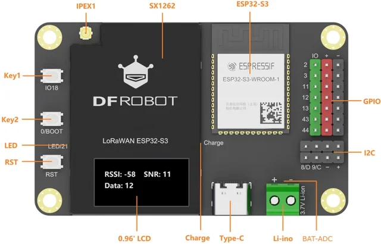

# LoRaWAN ESP32-S3 Dev Board / DFR1195

**DFRobot** · ESP32-S3

Revision: Not identified

Coverage: Supporting documentation; physical pinout still needed

[Browse all manufacturers](../../../../BROWSE.md) · [Devices & IoT](../../../../DEVICES.md) · [Open in the browser guide](https://valleytech-black-wire-guide.pages.dev/?board=dfrobot-dfr1195)

Architecture: **Xtensa**

## Datasheets and original documentation

Board datasheet: **not yet recorded**. Visual reference: **available**.

[Original manufacturer product documentation](https://wiki.dfrobot.com/dfr1195/)

- **hardware-guide / board**: [Model specifications and hardware reference](https://wiki.dfrobot.com/dfr1195/) · online
- **design-files / board**: [Layout](https://dfimg.dfrobot.com/wiki/22836/DFR1195_lorawan-esp32-s3_layout_V1.0.pdf) · [saved document](../../../../library/media/06653f569b238a21530f974bab17077a22becc6e71d5b5e77900e2875dbfd6bb.pdf)
- **schematic / board**: [Schematics](https://dfimg.dfrobot.com/wiki/22836/DFR1195_lorawan-esp32-s3_schematics_V1.0.pdf) · [saved document](../../../../library/media/330176e7cdf03881a09ef5beeafb3679d15e736281d7c84ac9eee923fc3fb456.pdf)

Original source reviewed for model and visual type. Pin assignments and electrical limits have not been independently verified. Match the PCB revision before wiring.

[Documentation coverage and remaining gaps](../../../../DOCUMENTATION.md)

## Specifications and hardware documentation

- [Original model specifications](https://wiki.dfrobot.com/dfr1195/)

## LoRaWAN ESP32-S3 Dev Board — On-board Function Diagram

**board labeling image** · Reviewed source · WEBP

[Open original reference](../../../../library/media/cd7ea93f592cef67fa59209980249f5015f02f8a4e8c08d7a0f53b6e4d25bd33.webp)

**Credit and rights:** DFRobot / original artwork contributors. Asset-specific redistribution and print rights are not established. Black Wire's editorial license does not relicense this artwork.. Source/manufacturer: DFRobot.

[Source 1](https://dfimg.dfrobot.com/62d52567aa9508d63a4247a1/wikien/fc5dbb66629b30fb565f3d240a0d2316_0x0.png.webp) · [Source 2](https://wiki.dfrobot.com/dfr1195/)

Original source reviewed for model and visual type. Pin assignments and electrical limits have not been independently verified. Match the PCB revision before wiring.

Image revision: Not identified

SHA-256: `cd7ea93f592cef67fa59209980249f5015f02f8a4e8c08d7a0f53b6e4d25bd33`

## Layout

**original reference PDF** · Reviewed source · PDF

[Open original reference](../../../../library/media/06653f569b238a21530f974bab17077a22becc6e71d5b5e77900e2875dbfd6bb.pdf)

**Credit and rights:** DFRobot / original artwork contributors. Asset-specific redistribution and print rights are not established. Black Wire's editorial license does not relicense this artwork.. Source/manufacturer: DFRobot.

[Source 1](https://dfimg.dfrobot.com/wiki/22836/DFR1195_lorawan-esp32-s3_layout_V1.0.pdf) · [Source 2](https://wiki.dfrobot.com/dfr1195/)

Original source reviewed for model and visual type. Pin assignments and electrical limits have not been independently verified. Match the PCB revision before wiring.

Image revision: Not identified

SHA-256: `06653f569b238a21530f974bab17077a22becc6e71d5b5e77900e2875dbfd6bb`

## Schematics

**original reference PDF** · Reviewed source · PDF

[Open original reference](../../../../library/media/330176e7cdf03881a09ef5beeafb3679d15e736281d7c84ac9eee923fc3fb456.pdf)

**Credit and rights:** DFRobot / original artwork contributors. Asset-specific redistribution and print rights are not established. Black Wire's editorial license does not relicense this artwork.. Source/manufacturer: DFRobot.

[Source 1](https://dfimg.dfrobot.com/wiki/22836/DFR1195_lorawan-esp32-s3_schematics_V1.0.pdf) · [Source 2](https://wiki.dfrobot.com/dfr1195/)

Original source reviewed for model and visual type. Pin assignments and electrical limits have not been independently verified. Match the PCB revision before wiring.

Image revision: Not identified

SHA-256: `330176e7cdf03881a09ef5beeafb3679d15e736281d7c84ac9eee923fc3fb456`

Pin assignments have not been independently electrically verified. Check board revision before wiring.
