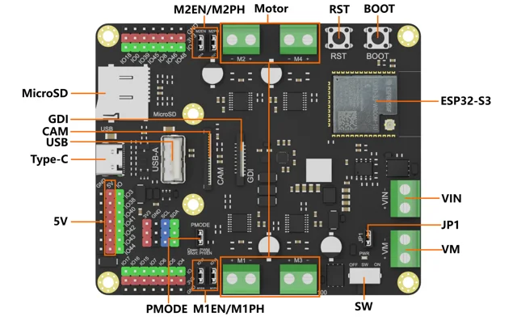

# Romeo ESP32-S3 Robot Development Board / DFR0994

**DFRobot** · ESP32-S3

Revision: Not identified

Coverage: Supporting documentation; physical pinout still needed

[Browse all manufacturers](../../../../BROWSE.md) · [Devices & IoT](../../../../DEVICES.md) · [Open in the browser guide](https://valleytech-black-wire-guide.pages.dev/?board=dfrobot-dfr0994)

Architecture: **Xtensa**

## Datasheets and original documentation

Board datasheet: **not yet recorded**. Visual reference: **available**.

[Original manufacturer product documentation](https://wiki.dfrobot.com/dfr0994/)

- **hardware-guide / board**: [Model specifications and hardware reference](https://wiki.dfrobot.com/dfr0994/) · online

Original source reviewed for model and visual type. Pin assignments and electrical limits have not been independently verified. Match the PCB revision before wiring.

[Documentation coverage and remaining gaps](../../../../DOCUMENTATION.md)

## Specifications and hardware documentation

- [Original model specifications](https://wiki.dfrobot.com/dfr0994/)

## Romeo ESP32-S3 Robot Development Board — On-board Function Diagram

**board labeling image** · Reviewed source · WEBP

[Open original reference](../../../../library/media/c0cad9979b3baaeb425eceb7da1f2ccc9b49df6f72da9076db1694593eb7ac9f.webp)

**Credit and rights:** DFRobot / original artwork contributors. Asset-specific redistribution and print rights are not established. Black Wire's editorial license does not relicense this artwork.. Source/manufacturer: DFRobot.

[Source 1](https://dfimg.dfrobot.com/62d52567aa9508d63a4247a1/wikien/0469b1669e1541ff11a1303a7a466c07_0x0.png.webp) · [Source 2](https://wiki.dfrobot.com/dfr0994/)

Original source reviewed for model and visual type. Pin assignments and electrical limits have not been independently verified. Match the PCB revision before wiring.

Image revision: Not identified

SHA-256: `c0cad9979b3baaeb425eceb7da1f2ccc9b49df6f72da9076db1694593eb7ac9f`

Pin assignments have not been independently electrically verified. Check board revision before wiring.
