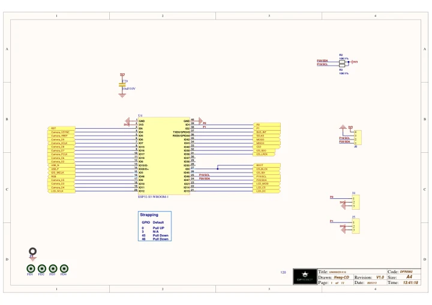

# UNIHIKER K10 / DFR0992-EN

**DFRobot** · ESP32-S3

Revision: Not identified

Coverage: Manufacturer references reviewed by scope; independent electrical and all-connector review pending

[Browse all manufacturers](../../../../BROWSE.md) · [Devices & IoT](../../../../DEVICES.md) · [Open in the browser guide](https://valleytech-black-wire-guide.pages.dev/?board=dfrobot-dfr0992-en)

Device category: **Controllers & instruments**

Original source reviewed for model and visual type. Pin assignments and electrical limits have not been independently verified. Match the PCB revision before wiring.

Architecture: **Xtensa**

## Datasheets and original documentation

Board datasheet: **not yet recorded**. Visual reference: **available**.

[Manufacturer hardware documentation](https://www.unihiker.com/wiki/K10/HardwareReference/hardwarereference_stepschematic/)

- **hardware-guide / board**: [Model specifications and hardware reference](https://wiki.dfrobot.com/dfr0992-en/) · online
- **schematic / board**: [Schematics](https://dfimg.dfrobot.com/wiki/24709/DFR0992-EN_unihiker-k10_schematics_V1.0.pdf) · [saved document](../../../../library/media/fc96ef054f2634064ce2895d963999681a933e58b2afd4e82971be3afc282794.pdf)
- **schematic / recorded-source**: [UNIHIKER K10 Schematic](https://www.unihiker.com/wiki/K10/HardwareReference/img/hardwarereference_onboard/UnihikerK10Schematic.pdf) · [saved document](../../../../library/media/82dcf164729303f234d91c384e2ee9bfcdb5a2f80b924d51c2ab3bbffba41021.pdf)
- **hardware-guide / board**: [Manufacturer pin and hardware documentation](https://www.unihiker.com/wiki/K10/HardwareReference/hardwarereference_stepschematic/) · online

Original source reviewed for model and visual type. Pin assignments and electrical limits have not been independently verified. Match the PCB revision before wiring.

[Documentation coverage and remaining gaps](../../../../DOCUMENTATION.md)

## Specifications and hardware documentation

- [Original model specifications](https://wiki.dfrobot.com/dfr0992-en/)

## Schematics

**original reference PDF** · Reviewed source · PDF

[Open original reference](../../../../library/media/fc96ef054f2634064ce2895d963999681a933e58b2afd4e82971be3afc282794.pdf)

**Credit and rights:** DFRobot / original artwork contributors. Asset-specific redistribution and print rights are not established. Black Wire's editorial license does not relicense this artwork.. Source/manufacturer: DFRobot.

[Source 1](https://dfimg.dfrobot.com/wiki/24709/DFR0992-EN_unihiker-k10_schematics_V1.0.pdf) · [Source 2](https://wiki.dfrobot.com/dfr0992-en/)

Original source reviewed for model and visual type. Pin assignments and electrical limits have not been independently verified. Match the PCB revision before wiring.

Image revision: Not identified

SHA-256: `fc96ef054f2634064ce2895d963999681a933e58b2afd4e82971be3afc282794`

## UNIHIKER K10 Schematic

**original reference PDF** · Source identity and visual scope inspected; PDF review covers first-page preview. Independent electrical and all-connector completeness review pending. · PDF

[Open original reference](../../../../library/media/82dcf164729303f234d91c384e2ee9bfcdb5a2f80b924d51c2ab3bbffba41021.pdf)

**Credit and rights:** Manufacturer artwork; reuse and print rights not established. Inclusion does not relicense the original.. Source/manufacturer: DFRobot.

[Source 1](https://www.unihiker.com/wiki/K10/HardwareReference/img/hardwarereference_onboard/UnihikerK10Schematic.pdf) · [Source 2](https://www.unihiker.com/wiki/K10/HardwareReference/hardwarereference_stepschematic/)

Manufacturer source retained unchanged. Source identity and visual scope inspected; PDF review covers first-page preview. Independent electrical and all-connector completeness review pending.

Image revision: As supplied in the original; match exact board revision

SHA-256: `82dcf164729303f234d91c384e2ee9bfcdb5a2f80b924d51c2ab3bbffba41021`

Pin assignments have not been independently electrically verified. Check board revision before wiring.
