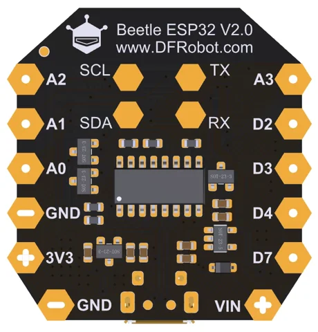

# Beetle ESP32 WiFi Bluetooth Board / DFR0575

**DFRobot** · ESP32

Revision: Not identified

Coverage: Supporting documentation; physical pinout still needed

[Browse all manufacturers](../../../../BROWSE.md) · [Devices & IoT](../../../../DEVICES.md) · [Open in the browser guide](https://valleytech-black-wire-guide.pages.dev/?board=dfrobot-dfr0575)

Architecture: **Xtensa**

## Datasheets and original documentation

Board datasheet: **not yet recorded**. Visual reference: **available**.

[Original manufacturer product documentation](https://wiki.dfrobot.com/dfr0575/)

- **hardware-guide / board**: [Model specifications and hardware reference](https://wiki.dfrobot.com/dfr0575/) · online
- **schematic / board**: [Schematics](https://dfimg.dfrobot.com/wiki/18603/DFR0575_beetle-esp32-wifi-bluetooth-board_schematics_v1.pdf) · [saved document](../../../../library/media/222b05c58f90ae2464592cf939a120d2bd02a72bd9d0b29abacb78f3334830da.pdf)

Original source reviewed for model and visual type. Pin assignments and electrical limits have not been independently verified. Match the PCB revision before wiring.

[Documentation coverage and remaining gaps](../../../../DOCUMENTATION.md)

## Specifications and hardware documentation

- [Original model specifications](https://wiki.dfrobot.com/dfr0575/)

## Beetle ESP32 WiFi Bluetooth Board — Beetle ESP32 WiFi Bluetooth Board Pinout2

**board labeling image** · Reviewed source · WEBP

[Open original reference](../../../../library/media/b51bbb4b4e03ad1657f08d1045b94d1c38b4a35246f79f36caddad61f78ef807.webp)

**Credit and rights:** DFRobot / original artwork contributors. Asset-specific redistribution and print rights are not established. Black Wire's editorial license does not relicense this artwork.. Source/manufacturer: DFRobot.

[Source 1](https://dfimg.dfrobot.com/8bb17537945149e4bbdf9d76904713d0/wikien/c1143155ca72fa2f695a19563dd40593_0x0.png.webp) · [Source 2](https://wiki.dfrobot.com/dfr0575/)

Original source reviewed for model and visual type. Pin assignments and electrical limits have not been independently verified. Match the PCB revision before wiring.

Image revision: Not identified

SHA-256: `b51bbb4b4e03ad1657f08d1045b94d1c38b4a35246f79f36caddad61f78ef807`

## Schematics

**original reference PDF** · Reviewed source · PDF

[Open original reference](../../../../library/media/222b05c58f90ae2464592cf939a120d2bd02a72bd9d0b29abacb78f3334830da.pdf)

**Credit and rights:** DFRobot / original artwork contributors. Asset-specific redistribution and print rights are not established. Black Wire's editorial license does not relicense this artwork.. Source/manufacturer: DFRobot.

[Source 1](https://dfimg.dfrobot.com/wiki/18603/DFR0575_beetle-esp32-wifi-bluetooth-board_schematics_v1.pdf) · [Source 2](https://wiki.dfrobot.com/dfr0575/)

Original source reviewed for model and visual type. Pin assignments and electrical limits have not been independently verified. Match the PCB revision before wiring.

Image revision: Not identified

SHA-256: `222b05c58f90ae2464592cf939a120d2bd02a72bd9d0b29abacb78f3334830da`

Pin assignments have not been independently electrically verified. Check board revision before wiring.
