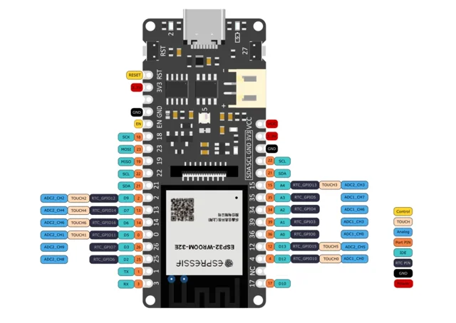

# FireBeetle 2 ESP32-E (DFR1139) / DFR1139

**DFRobot** · ESP32

Revision: Not identified

Coverage: Physical pinout reference; independent completeness review pending

[Browse all manufacturers](../../../../BROWSE.md) · [Devices & IoT](../../../../DEVICES.md) · [Open in the browser guide](https://valleytech-black-wire-guide.pages.dev/?board=dfrobot-dfr1139)

Architecture: **Xtensa**

## Datasheets and original documentation

Board datasheet: **not yet recorded**. Visual reference: **available**.

[Original manufacturer product documentation](https://wiki.dfrobot.com/dfr1139/)

- **hardware-guide / board**: [Model specifications and hardware reference](https://wiki.dfrobot.com/dfr1139/) · online
- **schematic / board**: [Schematics](https://dfimg.dfrobot.com/wiki/20495/DFR1139_firebeetle-2-esp32-e-n16r8_schematics_v1.0.pdf) · [saved document](../../../../library/media/56042a354795955e18ae304543f7317ce0816b7cf10c9234df01222edf4847e4.pdf)
- **component-datasheet / component**: [Component datasheet (not a board datasheet)](https://dfimg.dfrobot.com/wiki/20495/DFR1139_firebeetle-2-esp32-e-n16r8_datasheet_v1.0.pdf) · online

Original source reviewed for model and visual type. Pin assignments and electrical limits have not been independently verified. Match the PCB revision before wiring. Source identity conflict: page heading says N16R8, while title and diagram say N16R2. Confirm memory/revision from the hardware; no single memory configuration is asserted.

[Documentation coverage and remaining gaps](../../../../DOCUMENTATION.md)

## Specifications and hardware documentation

- [Original model specifications](https://wiki.dfrobot.com/dfr1139/)

## FireBeetle 2 ESP32-E (DFR1139) — DFR1139-Pinout

**pinout image** · Reviewed source · WEBP

[Open original reference](../../../../library/media/da33f787ec66a622e1891b498e3690358184b8ba19f5576a17d425ad73e7a863.webp)

**Credit and rights:** DFRobot / original artwork contributors. Asset-specific redistribution and print rights are not established. Black Wire's editorial license does not relicense this artwork.. Source/manufacturer: DFRobot.

[Source 1](https://dfimg.dfrobot.com/60c1e008bddfc41c3293de80/wiki/85d558793ff6932a75db99eb01ad8a0f_0x0.png.webp) · [Source 2](https://wiki.dfrobot.com/dfr1139/)

Original source reviewed for model and visual type. Pin assignments and electrical limits have not been independently verified. Match the PCB revision before wiring. Source identity conflict: page heading says N16R8, while title and diagram say N16R2. Confirm memory/revision from the hardware; no single memory configuration is asserted.

Image revision: Not identified

SHA-256: `da33f787ec66a622e1891b498e3690358184b8ba19f5576a17d425ad73e7a863`

## Schematics

**original reference PDF** · Reviewed source · PDF

[Open original reference](../../../../library/media/56042a354795955e18ae304543f7317ce0816b7cf10c9234df01222edf4847e4.pdf)

**Credit and rights:** DFRobot / original artwork contributors. Asset-specific redistribution and print rights are not established. Black Wire's editorial license does not relicense this artwork.. Source/manufacturer: DFRobot.

[Source 1](https://dfimg.dfrobot.com/wiki/20495/DFR1139_firebeetle-2-esp32-e-n16r8_schematics_v1.0.pdf) · [Source 2](https://wiki.dfrobot.com/dfr1139/)

Original source reviewed for model and visual type. Pin assignments and electrical limits have not been independently verified. Match the PCB revision before wiring. Source identity conflict: page heading says N16R8, while title and diagram say N16R2. Confirm memory/revision from the hardware; no single memory configuration is asserted.

Image revision: Not identified

SHA-256: `56042a354795955e18ae304543f7317ce0816b7cf10c9234df01222edf4847e4`

Pin assignments have not been independently electrically verified. Check board revision before wiring.
