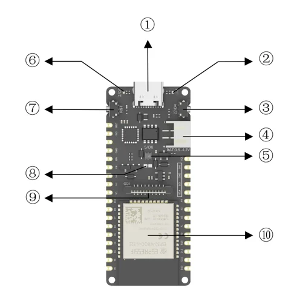
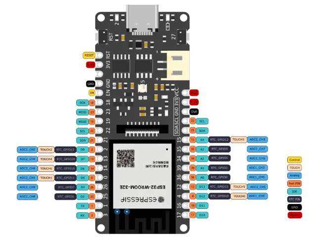

# FireBeetle 2 ESP32-E IoT Microcontroller / DFR0654

**DFRobot** · ESP32

Revision: Not identified

Coverage: Physical pinout reference; independent completeness review pending

[Browse all manufacturers](../../../../BROWSE.md) · [Devices & IoT](../../../../DEVICES.md) · [Open in the browser guide](https://valleytech-black-wire-guide.pages.dev/?board=dfrobot-dfr0654)

Architecture: **Xtensa**

## Datasheets and original documentation

Board datasheet: **not yet recorded**. Visual reference: **available**.

[Original manufacturer product documentation](https://wiki.dfrobot.com/dfr0654/)

- **hardware-guide / board**: [Model specifications and hardware reference](https://wiki.dfrobot.com/dfr0654/) · online
- **schematic / board**: [Schematics](https://dfimg.dfrobot.com/wiki/23249/DFR0654_firebeetle-2-esp32-e_schematics_v1.0.pdf) · [saved document](../../../../library/media/491da904105bdf368d715173fd9098ed2610dbff5d2afd7ffa688e5dcc2fdf92.pdf)
- **component-datasheet / component**: [Component datasheet (not a board datasheet)](https://dfimg.dfrobot.com/wiki/23249/DFR0654_firebeetle-2-esp32-e_datasheet_v1.0.pdf) · online

Original source reviewed for model and visual type. Pin assignments and electrical limits have not been independently verified. Match the PCB revision before wiring.

[Documentation coverage and remaining gaps](../../../../DOCUMENTATION.md)

## Specifications and hardware documentation

- [Original model specifications](https://wiki.dfrobot.com/dfr0654/)

## FireBeetle 2 ESP32-E IoT Microcontroller — DFR0564-Board Overview

**board labeling image** · Reviewed source · WEBP

[Open original reference](../../../../library/media/9178014eabf7392cf57d73e2a53020b09cf16c2193203acd527e1c0fd6c62698.webp)

**Credit and rights:** DFRobot / original artwork contributors. Asset-specific redistribution and print rights are not established. Black Wire's editorial license does not relicense this artwork.. Source/manufacturer: DFRobot.

[Source 1](https://dfimg.dfrobot.com/nobody/wiki/dc5010503489e18cee41000e77b64363_0x0.png.webp) · [Source 2](https://wiki.dfrobot.com/dfr0654/)

Original source reviewed for model and visual type. Pin assignments and electrical limits have not been independently verified. Match the PCB revision before wiring.

Image revision: Not identified

SHA-256: `9178014eabf7392cf57d73e2a53020b09cf16c2193203acd527e1c0fd6c62698`

## FireBeetle 2 ESP32-E IoT Microcontroller — DFR0654-Pinout

**pinout image** · Reviewed source · WEBP

[Open original reference](../../../../library/media/90c4b19b83ec3f914d4344645e5a9d2c7afcf87a56b839878297c5b6d3bd3883.webp)

**Credit and rights:** DFRobot / original artwork contributors. Asset-specific redistribution and print rights are not established. Black Wire's editorial license does not relicense this artwork.. Source/manufacturer: DFRobot.

[Source 1](https://dfimg.dfrobot.com/62b2fb5caa613609f271523c/wiki/e25b0ab211e60424824371baad2c0c81_0x0.png.webp) · [Source 2](https://wiki.dfrobot.com/dfr0654/)

Original source reviewed for model and visual type. Pin assignments and electrical limits have not been independently verified. Match the PCB revision before wiring.

Image revision: Not identified

SHA-256: `90c4b19b83ec3f914d4344645e5a9d2c7afcf87a56b839878297c5b6d3bd3883`

## Schematics

**original reference PDF** · Reviewed source · PDF

[Open original reference](../../../../library/media/491da904105bdf368d715173fd9098ed2610dbff5d2afd7ffa688e5dcc2fdf92.pdf)

**Credit and rights:** DFRobot / original artwork contributors. Asset-specific redistribution and print rights are not established. Black Wire's editorial license does not relicense this artwork.. Source/manufacturer: DFRobot.

[Source 1](https://dfimg.dfrobot.com/wiki/23249/DFR0654_firebeetle-2-esp32-e_schematics_v1.0.pdf) · [Source 2](https://wiki.dfrobot.com/dfr0654/)

Original source reviewed for model and visual type. Pin assignments and electrical limits have not been independently verified. Match the PCB revision before wiring.

Image revision: Not identified

SHA-256: `491da904105bdf368d715173fd9098ed2610dbff5d2afd7ffa688e5dcc2fdf92`

Pin assignments have not been independently electrically verified. Check board revision before wiring.
