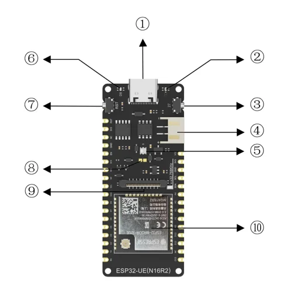
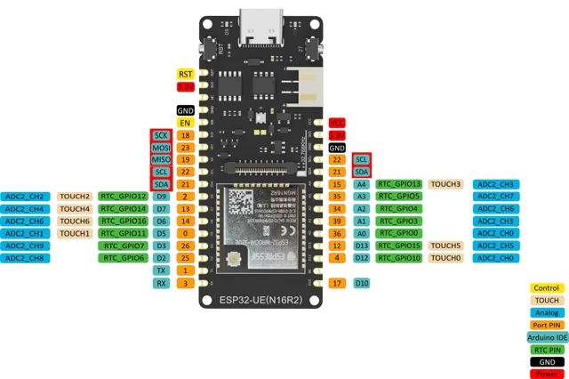

# FireBeetle 2 ESP32-UE (N16R2) IoT Board / DFR1140

**DFRobot** · ESP32

Revision: Not identified

Coverage: Physical pinout reference; independent completeness review pending

[Browse all manufacturers](../../../../BROWSE.md) · [Devices & IoT](../../../../DEVICES.md) · [Open in the browser guide](https://valleytech-black-wire-guide.pages.dev/?board=dfrobot-dfr1140)

Architecture: **Xtensa**

## Datasheets and original documentation

Board datasheet: **not yet recorded**. Visual reference: **available**.

[Original manufacturer product documentation](https://wiki.dfrobot.com/dfr1140/)

- **hardware-guide / board**: [Model specifications and hardware reference](https://wiki.dfrobot.com/dfr1140/) · online
- **schematic / board**: [Schematics](https://dfimg.dfrobot.com/wiki/20500/DFR1140_firebeetle-2-esp32-ue-n16r2-iot-board_schematics_v1.0.pdf) · [saved document](../../../../library/media/83b9f67506918fb892219e151aa44e445e3ee5ab321d7da789b99ad2791b7524.pdf)
- **component-datasheet / component**: [Component datasheet (not a board datasheet)](https://dfimg.dfrobot.com/wiki/20500/DFR1140_firebeetle-2-esp32-ue-n16r2-iot-board_datasheet_v1.0.pdf) · online

Original source reviewed for model and visual type. Pin assignments and electrical limits have not been independently verified. Match the PCB revision before wiring.

[Documentation coverage and remaining gaps](../../../../DOCUMENTATION.md)

## Specifications and hardware documentation

- [Original model specifications](https://wiki.dfrobot.com/dfr1140/)

## FireBeetle 2 ESP32-UE (N16R2) IoT Board — Pinout

**board labeling image** · Reviewed source · WEBP

[Open original reference](../../../../library/media/ce9606bb8052141382bb4d4c5d61ebdfb03a49fa16f103ce9cc0ea36f5eb21da.webp)

**Credit and rights:** DFRobot / original artwork contributors. Asset-specific redistribution and print rights are not established. Black Wire's editorial license does not relicense this artwork.. Source/manufacturer: DFRobot.

[Source 1](https://dfimg.dfrobot.com/60c1e008bddfc41c3293de80/wiki/c7bebd6010736415dbddf804f95e7be7_0x0.png.webp) · [Source 2](https://wiki.dfrobot.com/dfr1140/)

Original source reviewed for model and visual type. Pin assignments and electrical limits have not been independently verified. Match the PCB revision before wiring.

Image revision: Not identified

SHA-256: `ce9606bb8052141382bb4d4c5d61ebdfb03a49fa16f103ce9cc0ea36f5eb21da`

## FireBeetle 2 ESP32-UE (N16R2) IoT Board — Pinout

**pinout image** · Reviewed source · WEBP

[Open original reference](../../../../library/media/523cbb938b4a6853dc299f04e55f7a253ce083393c6ded1351879bdc7dfa11e6.webp)

**Credit and rights:** DFRobot / original artwork contributors. Asset-specific redistribution and print rights are not established. Black Wire's editorial license does not relicense this artwork.. Source/manufacturer: DFRobot.

[Source 1](https://dfimg.dfrobot.com/60c1e008bddfc41c3293de80/wiki/ec197947fbd1d0f18f148e38baa7192a_0x0.png.webp) · [Source 2](https://wiki.dfrobot.com/dfr1140/)

Original source reviewed for model and visual type. Pin assignments and electrical limits have not been independently verified. Match the PCB revision before wiring.

Image revision: Not identified

SHA-256: `523cbb938b4a6853dc299f04e55f7a253ce083393c6ded1351879bdc7dfa11e6`

## Schematics

**original reference PDF** · Reviewed source · PDF

[Open original reference](../../../../library/media/83b9f67506918fb892219e151aa44e445e3ee5ab321d7da789b99ad2791b7524.pdf)

**Credit and rights:** DFRobot / original artwork contributors. Asset-specific redistribution and print rights are not established. Black Wire's editorial license does not relicense this artwork.. Source/manufacturer: DFRobot.

[Source 1](https://dfimg.dfrobot.com/wiki/20500/DFR1140_firebeetle-2-esp32-ue-n16r2-iot-board_schematics_v1.0.pdf) · [Source 2](https://wiki.dfrobot.com/dfr1140/)

Original source reviewed for model and visual type. Pin assignments and electrical limits have not been independently verified. Match the PCB revision before wiring.

Image revision: Not identified

SHA-256: `83b9f67506918fb892219e151aa44e445e3ee5ab321d7da789b99ad2791b7524`

Pin assignments have not been independently electrically verified. Check board revision before wiring.
