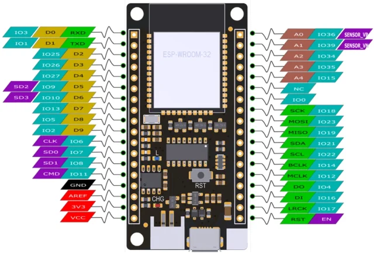

# FireBeetle ESP32 IoT Microcontroller / DFR0478

**DFRobot** · ESP32

Revision: Not identified

Coverage: Physical pinout reference; independent completeness review pending

[Browse all manufacturers](../../../../BROWSE.md) · [Devices & IoT](../../../../DEVICES.md) · [Open in the browser guide](https://valleytech-black-wire-guide.pages.dev/?board=dfrobot-dfr0478)

Architecture: **Xtensa**

## Datasheets and original documentation

Board datasheet: **not yet recorded**. Visual reference: **available**.

[Original manufacturer product documentation](https://wiki.dfrobot.com/dfr0478/)

- **hardware-guide / board**: [Model specifications and hardware reference](https://wiki.dfrobot.com/dfr0478/) · online
- **schematic / board**: [Schematics](https://dfimg.dfrobot.com/wiki/19339/DFR0478_firebeetle-esp32-board_schematics_V4.0.pdf) · [saved document](../../../../library/media/5b95a03cc72b96f92422c065da06c510625fa0b2e47c10ba889801c3d05d2e6a.pdf)
- **hardware-guide / board**: [Board user manual V0.1 (linked as Datasheet)](https://dfimg.dfrobot.com/wiki/19339/DFR0478_firebeetle-esp32-board_datasheet_v1.0.pdf) · [saved document](../../../../library/media/d4d8b407f75c6a009de6ebd3788ea21ac604b95dace603c11d4cc4f7b4092057.pdf)

Original source reviewed for model and visual type. Pin assignments and electrical limits have not been independently verified. Match the PCB revision before wiring.

[Documentation coverage and remaining gaps](../../../../DOCUMENTATION.md)

## Specifications and hardware documentation

- [Original model specifications](https://wiki.dfrobot.com/dfr0478/)

## FireBeetle ESP32 IoT Microcontroller — DFR0478-Pinout

**pinout image** · Reviewed source · WEBP

[Open original reference](../../../../library/media/2d94aab44a24758486d4f261b838ebcdccccd8f617e37a3756e3090619c6e1c4.webp)

**Credit and rights:** DFRobot / original artwork contributors. Asset-specific redistribution and print rights are not established. Black Wire's editorial license does not relicense this artwork.. Source/manufacturer: DFRobot.

[Source 1](https://dfimg.dfrobot.com/62fba4cb025a892c98c6da64/wikien/555ad7fa66fecc61fe288e251ac267ce_0x0.png.webp) · [Source 2](https://wiki.dfrobot.com/dfr0478/)

Original source reviewed for model and visual type. Pin assignments and electrical limits have not been independently verified. Match the PCB revision before wiring.

Image revision: Not identified

SHA-256: `2d94aab44a24758486d4f261b838ebcdccccd8f617e37a3756e3090619c6e1c4`

## Schematics

**original reference PDF** · Reviewed source · PDF

[Open original reference](../../../../library/media/5b95a03cc72b96f92422c065da06c510625fa0b2e47c10ba889801c3d05d2e6a.pdf)

**Credit and rights:** DFRobot / original artwork contributors. Asset-specific redistribution and print rights are not established. Black Wire's editorial license does not relicense this artwork.. Source/manufacturer: DFRobot.

[Source 1](https://dfimg.dfrobot.com/wiki/19339/DFR0478_firebeetle-esp32-board_schematics_V4.0.pdf) · [Source 2](https://wiki.dfrobot.com/dfr0478/)

Original source reviewed for model and visual type. Pin assignments and electrical limits have not been independently verified. Match the PCB revision before wiring.

Image revision: Not identified

SHA-256: `5b95a03cc72b96f92422c065da06c510625fa0b2e47c10ba889801c3d05d2e6a`

## Board user manual V0.1 (linked as Datasheet)

**original reference PDF** · Reviewed source · PDF

[Open original reference](../../../../library/media/d4d8b407f75c6a009de6ebd3788ea21ac604b95dace603c11d4cc4f7b4092057.pdf)

**Credit and rights:** DFRobot / original artwork contributors. Asset-specific redistribution and print rights are not established. Black Wire's editorial license does not relicense this artwork.. Source/manufacturer: DFRobot.

[Source 1](https://dfimg.dfrobot.com/wiki/19339/DFR0478_firebeetle-esp32-board_datasheet_v1.0.pdf) · [Source 2](https://wiki.dfrobot.com/dfr0478/)

Original source reviewed for model and visual type. Pin assignments and electrical limits have not been independently verified. Match the PCB revision before wiring.

Image revision: Not identified

SHA-256: `d4d8b407f75c6a009de6ebd3788ea21ac604b95dace603c11d4cc4f7b4092057`

Pin assignments have not been independently electrically verified. Check board revision before wiring.
