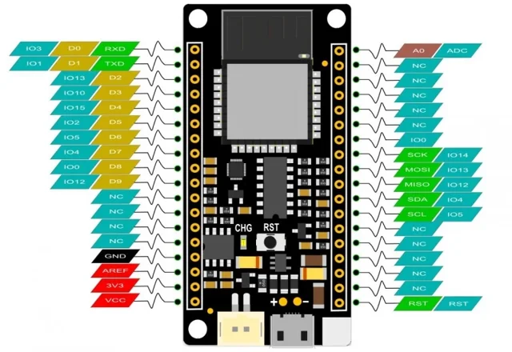

# FireBeetle ESP8266 IoT Development Board / DFR0489

**DFRobot** · ESP8266

Revision: Not identified

Coverage: Physical pinout reference; independent completeness review pending

[Browse all manufacturers](../../../../BROWSE.md) · [Devices & IoT](../../../../DEVICES.md) · [Open in the browser guide](https://valleytech-black-wire-guide.pages.dev/?board=dfrobot-dfr0489)

Architecture: **Xtensa**

## Datasheets and original documentation

Board datasheet: **not yet recorded**. Visual reference: **available**.

[Original manufacturer product documentation](https://wiki.dfrobot.com/dfr0489/)

- **hardware-guide / board**: [Model specifications and hardware reference](https://wiki.dfrobot.com/dfr0489/) · online
- **component-datasheet / component**: [Component datasheet (not a board datasheet)](https://dfimg.dfrobot.com/wiki/18643/DFR0489_esp8266-iot-development-board_datasheet_V1.0.pdf) · online

Original source reviewed for model and visual type. Pin assignments and electrical limits have not been independently verified. Match the PCB revision before wiring.

[Documentation coverage and remaining gaps](../../../../DOCUMENTATION.md)

## Specifications and hardware documentation

- [Original model specifications](https://wiki.dfrobot.com/dfr0489/)

## FireBeetle ESP8266 IoT Development Board — DFR0489_Pinout

**pinout image** · Reviewed source · WEBP

[Open original reference](../../../../library/media/7cc23577f400156258203303029fefbbcae844abe37d826480cd7045e2809258.webp)

**Credit and rights:** DFRobot / original artwork contributors. Asset-specific redistribution and print rights are not established. Black Wire's editorial license does not relicense this artwork.. Source/manufacturer: DFRobot.

[Source 1](https://dfimg.dfrobot.com/62fba4cb025a892c98c6da64/wikien/7bbd1acba9f4fa9eb66031213f734748_0x0.jpg.webp) · [Source 2](https://wiki.dfrobot.com/dfr0489/)

Original source reviewed for model and visual type. Pin assignments and electrical limits have not been independently verified. Match the PCB revision before wiring.

Image revision: Not identified

SHA-256: `7cc23577f400156258203303029fefbbcae844abe37d826480cd7045e2809258`

Pin assignments have not been independently electrically verified. Check board revision before wiring.
