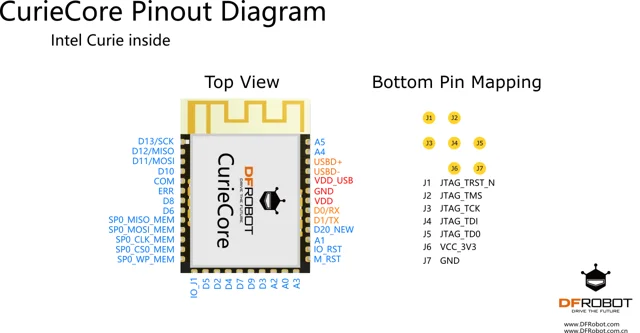

# CurieCore intel® Curie Neuron Module / TEL0110

**DFRobot** · Intel Curie

Revision: Not identified

Coverage: Physical pinout reference; independent completeness review pending

[Browse all manufacturers](../../../../BROWSE.md) · [Devices & IoT](../../../../DEVICES.md) · [Open in the browser guide](https://valleytech-black-wire-guide.pages.dev/?board=dfrobot-tel0110)

Architecture: **x86**

## Datasheets and original documentation

Board datasheet: **not yet recorded**. Visual reference: **available**.

[Original manufacturer product documentation](https://wiki.dfrobot.com/tel0110/)

- **hardware-guide / board**: [Model specifications and hardware reference](https://wiki.dfrobot.com/tel0110/) · online
- **schematic / board**: [Schematics](https://dfimg.dfrobot.com/wiki/17424/TEL0110_curie-core_schematics_V1.0.pdf) · [saved document](../../../../library/media/c06bd38cf85b0eb7b14cbd308b9042e2c6459da5cfb829fe2266df3917049e2c.pdf)

Original source reviewed for model and visual type. Pin assignments and electrical limits have not been independently verified. Match the PCB revision before wiring.

[Documentation coverage and remaining gaps](../../../../DOCUMENTATION.md)

## Specifications and hardware documentation

- [Original model specifications](https://wiki.dfrobot.com/tel0110/)

## CurieCore intel® Curie Neuron Module — Layout

**pinout image** · Reviewed source · WEBP

[Open original reference](../../../../library/media/b77f9a89995521af2f05b823bd3aa73ee87fc876274a640de2c46f4a337f8e83.webp)

**Credit and rights:** DFRobot / original artwork contributors. Asset-specific redistribution and print rights are not established. Black Wire's editorial license does not relicense this artwork.. Source/manufacturer: DFRobot.

[Source 1](https://dfimg.dfrobot.com/8116b3fb111c496b92a0efac795320fc/wikien/219de1f16a605f41bfa7d6bd9b430264_0x0.png.webp) · [Source 2](https://wiki.dfrobot.com/tel0110/)

Original source reviewed for model and visual type. Pin assignments and electrical limits have not been independently verified. Match the PCB revision before wiring.

Image revision: Not identified

SHA-256: `b77f9a89995521af2f05b823bd3aa73ee87fc876274a640de2c46f4a337f8e83`

## Schematics

**original reference PDF** · Reviewed source · PDF

[Open original reference](../../../../library/media/c06bd38cf85b0eb7b14cbd308b9042e2c6459da5cfb829fe2266df3917049e2c.pdf)

**Credit and rights:** DFRobot / original artwork contributors. Asset-specific redistribution and print rights are not established. Black Wire's editorial license does not relicense this artwork.. Source/manufacturer: DFRobot.

[Source 1](https://dfimg.dfrobot.com/wiki/17424/TEL0110_curie-core_schematics_V1.0.pdf) · [Source 2](https://wiki.dfrobot.com/tel0110/)

Original source reviewed for model and visual type. Pin assignments and electrical limits have not been independently verified. Match the PCB revision before wiring.

Image revision: Not identified

SHA-256: `c06bd38cf85b0eb7b14cbd308b9042e2c6459da5cfb829fe2266df3917049e2c`

Pin assignments have not been independently electrically verified. Check board revision before wiring.
