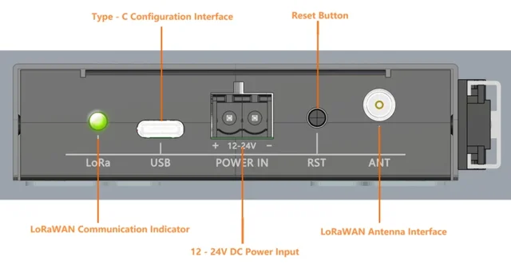
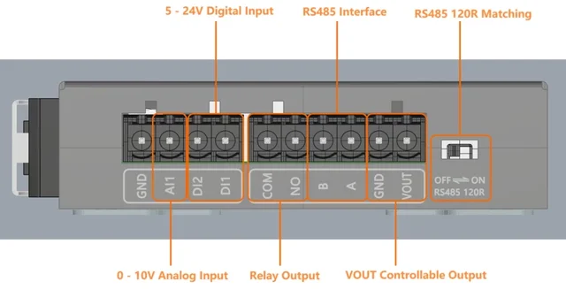

# LoRaWAN Control Terminal (915Mhz) / DFR1120-915

**DFRobot** · LoRaWAN

Revision: Not identified

Coverage: Supporting documentation; physical pinout still needed

[Browse all manufacturers](../../../../BROWSE.md) · [Devices & IoT](../../../../DEVICES.md) · [Open in the browser guide](https://valleytech-black-wire-guide.pages.dev/?board=dfrobot-dfr1120-915)

Device category: **Radios & GNSS**

Original source reviewed for model and visual type. Pin assignments and electrical limits have not been independently verified. Match the PCB revision before wiring.

## Datasheets and original documentation

Board datasheet: **not yet recorded**. Visual reference: **available**.

[Original manufacturer product documentation](https://wiki.dfrobot.com/dfr1120-915/)

- **hardware-guide / board**: [Model specifications and hardware reference](https://wiki.dfrobot.com/dfr1120-915/) · online

Original source reviewed for model and visual type. Pin assignments and electrical limits have not been independently verified. Match the PCB revision before wiring.

[Documentation coverage and remaining gaps](../../../../DOCUMENTATION.md)

## Specifications and hardware documentation

- [Original model specifications](https://wiki.dfrobot.com/dfr1120-915/)

## LoRaWAN Control Terminal (915Mhz) — Pinout

**board labeling image** · Reviewed source · WEBP

[Open original reference](../../../../library/media/02f630fd26be2179173a03ff2b1e67cb6b980255aaa5492c8712beca5473a29e.webp)

**Credit and rights:** DFRobot / original artwork contributors. Asset-specific redistribution and print rights are not established. Black Wire's editorial license does not relicense this artwork.. Source/manufacturer: DFRobot.

[Source 1](https://dfimg.dfrobot.com/62d52567aa9508d63a4247a1/wikien/5075572bc4dcbfe02f8fb6ff1aa8cd5f_0x0.png.webp) · [Source 2](https://wiki.dfrobot.com/dfr1120-915/)

Original source reviewed for model and visual type. Pin assignments and electrical limits have not been independently verified. Match the PCB revision before wiring.

Image revision: Not identified

SHA-256: `02f630fd26be2179173a03ff2b1e67cb6b980255aaa5492c8712beca5473a29e`

## LoRaWAN Control Terminal (915Mhz) — Pinout

**board labeling image** · Reviewed source · WEBP

[Open original reference](../../../../library/media/d75f8828995e4203f9410375d28b3983132f56bdd9d142e0564b28d0f6026155.webp)

**Credit and rights:** DFRobot / original artwork contributors. Asset-specific redistribution and print rights are not established. Black Wire's editorial license does not relicense this artwork.. Source/manufacturer: DFRobot.

[Source 1](https://dfimg.dfrobot.com/62d52567aa9508d63a4247a1/wikien/742ecae1fbd41e3f2bddcd84125c62bc_0x0.png.webp) · [Source 2](https://wiki.dfrobot.com/dfr1120-915/)

Original source reviewed for model and visual type. Pin assignments and electrical limits have not been independently verified. Match the PCB revision before wiring.

Image revision: Not identified

SHA-256: `d75f8828995e4203f9410375d28b3983132f56bdd9d142e0564b28d0f6026155`

Pin assignments have not been independently electrically verified. Check board revision before wiring.
