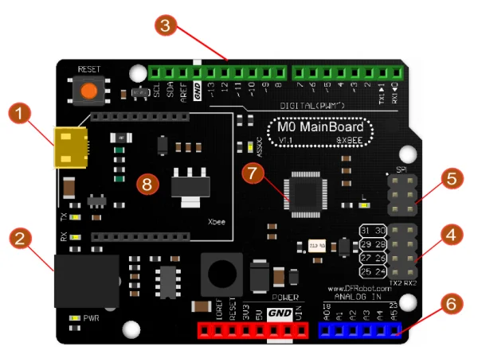

# DFRduino M0 Mainboard / DFR0392

**DFRobot** · NUC123

Revision: Not identified

Coverage: Supporting documentation; physical pinout still needed

[Browse all manufacturers](../../../../BROWSE.md) · [Devices & IoT](../../../../DEVICES.md) · [Open in the browser guide](https://valleytech-black-wire-guide.pages.dev/?board=dfrobot-dfr0392)

Architecture: **ARM**

## Datasheets and original documentation

Board datasheet: **not yet recorded**. Visual reference: **available**.

[Original manufacturer product documentation](https://wiki.dfrobot.com/dfr0392/)

- **hardware-guide / board**: [Model specifications and hardware reference](https://wiki.dfrobot.com/dfr0392/) · online
- **schematic / board**: [Schematics](https://dfimg.dfrobot.com/wiki/19326/DFR0392_dfrduino-m0-mianboard_schematics_v1.0.pdf) · [saved document](../../../../library/media/fc4e3bd417c034a140c9050fdfd6b1489c842d5e26cb41915a70312c5f005f26.pdf)
- **component-datasheet / component**: [Component datasheet (not a board datasheet)](https://dfimg.dfrobot.com/wiki/19326/DFR0392_dfrduino-m0-mianboard_datasheet_v1.0.pdf) · online

Original source reviewed for model and visual type. Pin assignments and electrical limits have not been independently verified. Match the PCB revision before wiring.

[Documentation coverage and remaining gaps](../../../../DOCUMENTATION.md)

## Specifications and hardware documentation

- [Original model specifications](https://wiki.dfrobot.com/dfr0392/)

## DFRduino M0 Mainboard — Board Overview

**board labeling image** · Reviewed source · PNG

[Open original reference](../../../../library/media/c47ca84b286399116efd09b31614a69b088912dd0f6cd01449526afdf0e3f101.png)

**Credit and rights:** DFRobot / original artwork contributors. Asset-specific redistribution and print rights are not established. Black Wire's editorial license does not relicense this artwork.. Source/manufacturer: DFRobot.

[Source 1](https://raw.githubusercontent.com/DFRobot/DFRobotMediaWikiImage/master/Image/DFRduino_M0_Mainboard.png) · [Source 2](https://wiki.dfrobot.com/dfr0392/)

Original source reviewed for model and visual type. Pin assignments and electrical limits have not been independently verified. Match the PCB revision before wiring.

Image revision: Not identified

SHA-256: `c47ca84b286399116efd09b31614a69b088912dd0f6cd01449526afdf0e3f101`

## Schematics

**original reference PDF** · Reviewed source · PDF

[Open original reference](../../../../library/media/fc4e3bd417c034a140c9050fdfd6b1489c842d5e26cb41915a70312c5f005f26.pdf)

**Credit and rights:** DFRobot / original artwork contributors. Asset-specific redistribution and print rights are not established. Black Wire's editorial license does not relicense this artwork.. Source/manufacturer: DFRobot.

[Source 1](https://dfimg.dfrobot.com/wiki/19326/DFR0392_dfrduino-m0-mianboard_schematics_v1.0.pdf) · [Source 2](https://wiki.dfrobot.com/dfr0392/)

Original source reviewed for model and visual type. Pin assignments and electrical limits have not been independently verified. Match the PCB revision before wiring.

Image revision: Not identified

SHA-256: `fc4e3bd417c034a140c9050fdfd6b1489c842d5e26cb41915a70312c5f005f26`

Pin assignments have not been independently electrically verified. Check board revision before wiring.
