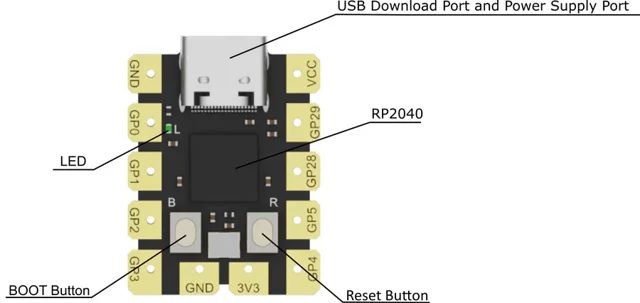
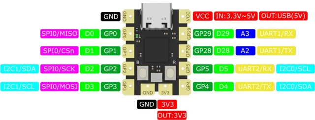

# Beetle RP2040 Mini Development Board / DFR0959

**DFRobot** · RP2040

Revision: Not identified

Coverage: Physical pinout reference; independent completeness review pending

[Browse all manufacturers](../../../../BROWSE.md) · [Devices & IoT](../../../../DEVICES.md) · [Open in the browser guide](https://valleytech-black-wire-guide.pages.dev/?board=dfrobot-dfr0959)

Architecture: **ARM**

## Datasheets and original documentation

Board datasheet: **not yet recorded**. Visual reference: **available**.

[Original manufacturer product documentation](https://wiki.dfrobot.com/dfr0959/)

- **hardware-guide / board**: [Model specifications and hardware reference](https://wiki.dfrobot.com/dfr0959/) · online
- **schematic / board**: [Schematics](https://dfimg.dfrobot.com/wiki/21123/DFR0959_beetle-pr2040-development-board_schematics_v1.pdf) · [saved document](../../../../library/media/cbade48667e6acee53d960fd2fce43b901966dffc1af214eaee700bf7bfd27de.pdf)
- **component-datasheet / component**: [Component datasheet (not a board datasheet)](https://dfimg.dfrobot.com/wiki/21123/DFR0959_beetle-pr2040-development-board_datasheet_v1.pdf) · online

Original source reviewed for model and visual type. Pin assignments and electrical limits have not been independently verified. Match the PCB revision before wiring.

[Documentation coverage and remaining gaps](../../../../DOCUMENTATION.md)

## Specifications and hardware documentation

- [Original model specifications](https://wiki.dfrobot.com/dfr0959/)

## Beetle RP2040 Mini Development Board — Pinout Function Indication

**board labeling image** · Reviewed source · WEBP

[Open original reference](../../../../library/media/fc0ba16ffce21c53ddfeef628ff0bf7dc353790623c65baeb95c2113a2a440c9.webp)

**Credit and rights:** DFRobot / original artwork contributors. Asset-specific redistribution and print rights are not established. Black Wire's editorial license does not relicense this artwork.. Source/manufacturer: DFRobot.

[Source 1](https://dfimg.dfrobot.com/nobody/wiki/2f449a0d6d1c59de308e7572b25c3e0d_0x0.jpg.webp) · [Source 2](https://wiki.dfrobot.com/dfr0959/)

Original source reviewed for model and visual type. Pin assignments and electrical limits have not been independently verified. Match the PCB revision before wiring.

Image revision: Not identified

SHA-256: `fc0ba16ffce21c53ddfeef628ff0bf7dc353790623c65baeb95c2113a2a440c9`

## Beetle RP2040 Mini Development Board — GPIO Pinout

**pinout image** · Reviewed source · WEBP

[Open original reference](../../../../library/media/2a6ccb147316dd3a55b43eb519f8f5c8336b2e96813c6538fc4c056f63857f7f.webp)

**Credit and rights:** DFRobot / original artwork contributors. Asset-specific redistribution and print rights are not established. Black Wire's editorial license does not relicense this artwork.. Source/manufacturer: DFRobot.

[Source 1](https://dfimg.dfrobot.com/nobody/wiki/9e1795b696d378bde3ec283ba9a3d777_0x0.jpg.webp) · [Source 2](https://wiki.dfrobot.com/dfr0959/)

Original source reviewed for model and visual type. Pin assignments and electrical limits have not been independently verified. Match the PCB revision before wiring.

Image revision: Not identified

SHA-256: `2a6ccb147316dd3a55b43eb519f8f5c8336b2e96813c6538fc4c056f63857f7f`

## Schematics

**original reference PDF** · Reviewed source · PDF

[Open original reference](../../../../library/media/cbade48667e6acee53d960fd2fce43b901966dffc1af214eaee700bf7bfd27de.pdf)

**Credit and rights:** DFRobot / original artwork contributors. Asset-specific redistribution and print rights are not established. Black Wire's editorial license does not relicense this artwork.. Source/manufacturer: DFRobot.

[Source 1](https://dfimg.dfrobot.com/wiki/21123/DFR0959_beetle-pr2040-development-board_schematics_v1.pdf) · [Source 2](https://wiki.dfrobot.com/dfr0959/)

Original source reviewed for model and visual type. Pin assignments and electrical limits have not been independently verified. Match the PCB revision before wiring.

Image revision: Not identified

SHA-256: `cbade48667e6acee53d960fd2fce43b901966dffc1af214eaee700bf7bfd27de`

Pin assignments have not been independently electrically verified. Check board revision before wiring.
