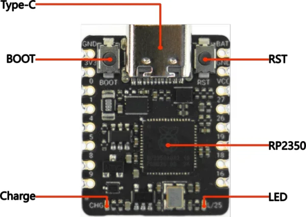
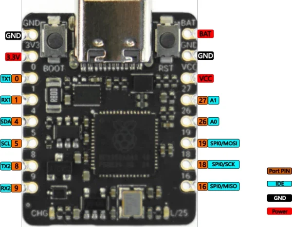

# Beetle RP2350 Development Board / DFR1188

**DFRobot** · RP2350

Revision: Not identified

Coverage: Physical pinout reference; independent completeness review pending

[Browse all manufacturers](../../../../BROWSE.md) · [Devices & IoT](../../../../DEVICES.md) · [Open in the browser guide](https://valleytech-black-wire-guide.pages.dev/?board=dfrobot-dfr1188)

Architecture: **ARM / RISC-V**

## Datasheets and original documentation

Board datasheet: **not yet recorded**. Visual reference: **available**.

[Original manufacturer product documentation](https://wiki.dfrobot.com/dfr1188/)

- **hardware-guide / board**: [Model specifications and hardware reference](https://wiki.dfrobot.com/dfr1188/) · online
- **schematic / board**: [Schematics](https://dfimg.dfrobot.com/wiki/21113/DFR1188_beetle-rp2350_schematics_V1.0.pdf) · [saved document](../../../../library/media/90a31cf6f80b37e017d0bf06c83caec69100c828aef69504a9d7b4157d347bae.pdf)
- **component-datasheet / component**: [Component datasheet (not a board datasheet)](https://dfimg.dfrobot.com/wiki/21113/DFR1188_beetle-rp2350_datasheet_V1.0.pdf) · online

Original source reviewed for model and visual type. Pin assignments and electrical limits have not been independently verified. Match the PCB revision before wiring.

[Documentation coverage and remaining gaps](../../../../DOCUMENTATION.md)

## Specifications and hardware documentation

- [Original model specifications](https://wiki.dfrobot.com/dfr1188/)

## Beetle RP2350 Development Board — Function Indication

**board labeling image** · Reviewed source · WEBP

[Open original reference](../../../../library/media/3d723dd4056e9eab91dd088344b44059e373410726f387075129a3d814f7928a.webp)

**Credit and rights:** DFRobot / original artwork contributors. Asset-specific redistribution and print rights are not established. Black Wire's editorial license does not relicense this artwork.. Source/manufacturer: DFRobot.

[Source 1](https://dfimg.dfrobot.com/5d57611a3416442fa39bffca/wiki/6015f3e68b89e944b05058ad3ae2d930_0x0.png.webp) · [Source 2](https://wiki.dfrobot.com/dfr1188/)

Original source reviewed for model and visual type. Pin assignments and electrical limits have not been independently verified. Match the PCB revision before wiring.

Image revision: Not identified

SHA-256: `3d723dd4056e9eab91dd088344b44059e373410726f387075129a3d814f7928a`

## Beetle RP2350 Development Board — Pin Indication

**pinout image** · Reviewed source · WEBP

[Open original reference](../../../../library/media/4f85db568c35ee25abb09aef08348f0a80792341e854d57aaf24bb98e2a96421.webp)

**Credit and rights:** DFRobot / original artwork contributors. Asset-specific redistribution and print rights are not established. Black Wire's editorial license does not relicense this artwork.. Source/manufacturer: DFRobot.

[Source 1](https://dfimg.dfrobot.com/5d57611a3416442fa39bffca/wiki/9c78e82ef6514fb44c4bd262c3bdf62a_0x0.png.webp) · [Source 2](https://wiki.dfrobot.com/dfr1188/)

Original source reviewed for model and visual type. Pin assignments and electrical limits have not been independently verified. Match the PCB revision before wiring.

Image revision: Not identified

SHA-256: `4f85db568c35ee25abb09aef08348f0a80792341e854d57aaf24bb98e2a96421`

## Schematics

**original reference PDF** · Reviewed source · PDF

[Open original reference](../../../../library/media/90a31cf6f80b37e017d0bf06c83caec69100c828aef69504a9d7b4157d347bae.pdf)

**Credit and rights:** DFRobot / original artwork contributors. Asset-specific redistribution and print rights are not established. Black Wire's editorial license does not relicense this artwork.. Source/manufacturer: DFRobot.

[Source 1](https://dfimg.dfrobot.com/wiki/21113/DFR1188_beetle-rp2350_schematics_V1.0.pdf) · [Source 2](https://wiki.dfrobot.com/dfr1188/)

Original source reviewed for model and visual type. Pin assignments and electrical limits have not been independently verified. Match the PCB revision before wiring.

Image revision: Not identified

SHA-256: `90a31cf6f80b37e017d0bf06c83caec69100c828aef69504a9d7b4157d347bae`

Pin assignments have not been independently electrically verified. Check board revision before wiring.
