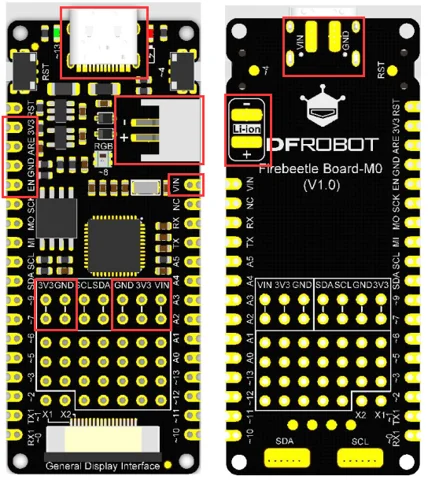

# Firebeetle 2 M0 Development Board / DFR0652

**DFRobot** · SAMD21

Revision: Not identified

Coverage: Supporting documentation; physical pinout still needed

[Browse all manufacturers](../../../../BROWSE.md) · [Devices & IoT](../../../../DEVICES.md) · [Open in the browser guide](https://valleytech-black-wire-guide.pages.dev/?board=dfrobot-dfr0652)

Architecture: **ARM**

## Datasheets and original documentation

Board datasheet: **not yet recorded**. Visual reference: **available**.

[Original manufacturer product documentation](https://wiki.dfrobot.com/dfr0652/)

- **hardware-guide / board**: [Model specifications and hardware reference](https://wiki.dfrobot.com/dfr0652/) · online
- **schematic / board**: [Schematics](https://dfimg.dfrobot.com/wiki/20200/DFR0652_firebeelte-m0-board_schematics_V1.0.pdf) · [saved document](../../../../library/media/71826bdb73e20b8afac8f2539483ec89dcde56f1fc558c8abd78d99bb27c4149.pdf)
- **component-datasheet / component**: [Component datasheet (not a board datasheet)](https://dfimg.dfrobot.com/wiki/20200/DFR0652_firebeelte-m0-board_datasheet_V1.0.pdf) · online

Original source reviewed for model and visual type. Pin assignments and electrical limits have not been independently verified. Match the PCB revision before wiring.

[Documentation coverage and remaining gaps](../../../../DOCUMENTATION.md)

## Specifications and hardware documentation

- [Original model specifications](https://wiki.dfrobot.com/dfr0652/)

## Firebeetle 2 M0 Development Board — DFR0652-Power & PinOut

**board labeling image** · Reviewed source · PNG

[Open original reference](../../../../library/media/10d5e6bb2de007d82cdc2051f2dc5737732eb9db5c2eefba7d7f60c5c748bb60.png)

**Credit and rights:** DFRobot / original artwork contributors. Asset-specific redistribution and print rights are not established. Black Wire's editorial license does not relicense this artwork.. Source/manufacturer: DFRobot.

[Source 1](https://dfimg.dfrobot.com/nobody/wiki/15d745833bdfd3ed2c1497c6ccd25c5a) · [Source 2](https://wiki.dfrobot.com/dfr0652/)

Original source reviewed for model and visual type. Pin assignments and electrical limits have not been independently verified. Match the PCB revision before wiring.

Image revision: Not identified

SHA-256: `10d5e6bb2de007d82cdc2051f2dc5737732eb9db5c2eefba7d7f60c5c748bb60`

## Schematics

**original reference PDF** · Reviewed source · PDF

[Open original reference](../../../../library/media/71826bdb73e20b8afac8f2539483ec89dcde56f1fc558c8abd78d99bb27c4149.pdf)

**Credit and rights:** DFRobot / original artwork contributors. Asset-specific redistribution and print rights are not established. Black Wire's editorial license does not relicense this artwork.. Source/manufacturer: DFRobot.

[Source 1](https://dfimg.dfrobot.com/wiki/20200/DFR0652_firebeelte-m0-board_schematics_V1.0.pdf) · [Source 2](https://wiki.dfrobot.com/dfr0652/)

Original source reviewed for model and visual type. Pin assignments and electrical limits have not been independently verified. Match the PCB revision before wiring.

Image revision: Not identified

SHA-256: `71826bdb73e20b8afac8f2539483ec89dcde56f1fc558c8abd78d99bb27c4149`

Pin assignments have not been independently electrically verified. Check board revision before wiring.
