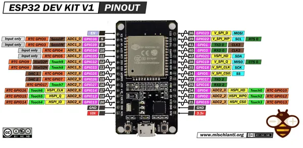

# ESP32 DEVKIT V1

**DOIT** · ESP32 original

Revision: 30-pin layout shown; do not substitute other header counts  
Coverage: Pinout image collected

[Browse all manufacturers](../../../../BROWSE.md) · [Desktop app](https://github.com/valleytechsolutions/black-wire-desktop)

## Pinout - Renzo Mischianti

**pinout image** · Reviewed source · JPG

[Open original reference](../../../../library/media/c43a9fb065bee4f947e68b8fef1157be50c99cbc9bf563f078b30801eac428b4.jpg)

**Credit and rights:** CC BY-NC-ND marking visible on image; exact license version and publication permissions not established. Source/manufacturer: DOIT.

[Source 1](https://mischianti.org/wp-content/uploads/2021/03/ESP32-DOIT-DEV-KIT-v1-pinout-mischianti.jpg) · [Source 2](https://mischianti.org/doit-esp32-dev-kit-v1-high-resolution-pinout-and-specs/)

Original public image by Renzo Mischianti, unchanged. Diagram/model matching is visual, not electrical verification. Exact PCB layout and revision must match; no inference of compatibility with lookalike marketplace clones.

SHA-256: `c43a9fb065bee4f947e68b8fef1157be50c99cbc9bf563f078b30801eac428b4`

Pin assignments have not been independently electrically verified. Check board revision before wiring.
