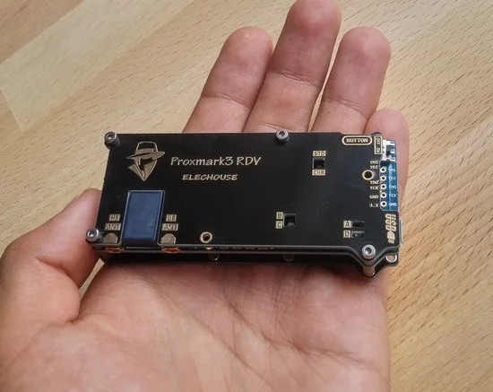
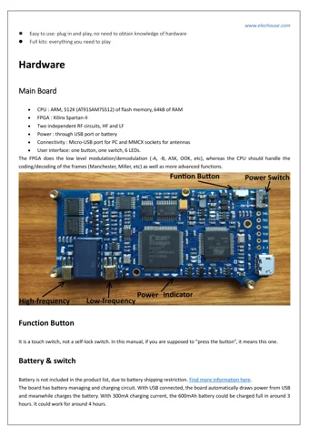
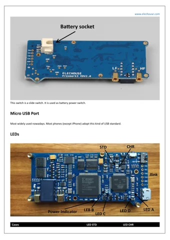

# ELECHOUSE Proxmark3 V2 DEV kits

**Elechouse** · AT91SAM7S512 / Xilinx Spartan-II

Revision: V2

Coverage: Supporting references; complete physical pinout still needed

[Browse all manufacturers](../../../../BROWSE.md) · [Devices & IoT](../../../../DEVICES.md) · [Open in the browser guide](https://valleytech-black-wire-guide.pages.dev/?board=elechouse-proxmark3-v2)

Device category: **Controllers & instruments**

Source identity and visual type reviewed; electrical limits and pin assignments have not been independently bench-verified. Match the exact PCB, connector orientation and interface mode. Only hardware-identification pages are presented as visual references. A complete GPIO / JTAG physical pinout is still needed.

Architecture: **ARM**

## Datasheets and original documentation

Board datasheet: **not yet recorded**. Visual reference: **available**.

[Original publisher / manufacturer documentation](https://www.elechouse.com/product/elechouse-proxmark3-v2-dev-kits/)

- **product-page / board**: [Exact product specifications and downloads](https://www.elechouse.com/product/elechouse-proxmark3-v2-dev-kits/) · online
- **hardware-guide / board**: [Original Proxmark3 V2 manual (external)](https://www.elechouse.com/elechouse/images/product/proxmark3_V2/Proxmark3%20V2%20User%20Guid.pdf) · online

Source identity and visual type reviewed; electrical limits and pin assignments have not been independently bench-verified. Match the exact PCB, connector orientation and interface mode. Only hardware-identification pages are presented as visual references. A complete GPIO / JTAG physical pinout is still needed.

[Documentation coverage and remaining gaps](../../../../DOCUMENTATION.md)

## Specifications and hardware documentation

- [Original hardware documentation](https://www.elechouse.com/product/elechouse-proxmark3-v2-dev-kits/)

## ELECHOUSE Proxmark3 V2 DEV kits — hardware identification and visible labels

**product photograph** · Source image / document inspected; independent electrical review pending · JPG

[Open original reference](../../../../library/media/8221d15754b56e1df759bcc7c0fd7f9638e7d78a086b7165eaea401f9cb8f761.jpg)

**Credit and rights:** Elechouse / original diagram and document contributors. Asset-specific redistribution and print rights are not established. Black Wire's editorial license does not relicense this artwork.. Source/manufacturer: Elechouse.

[Source 1](https://www.elechouse.com/wp-content/uploads/2022/04/proxmark3-1a.jpg) · [Source 2](https://www.elechouse.com/product/elechouse-proxmark3-v2-dev-kits/)

Source identity and visual type reviewed; electrical limits and pin assignments have not been independently bench-verified. Match the exact PCB, connector orientation and interface mode. Only hardware-identification pages are presented as visual references. A complete GPIO / JTAG physical pinout is still needed.

Image revision: V2

SHA-256: `8221d15754b56e1df759bcc7c0fd7f9638e7d78a086b7165eaea401f9cb8f761`

## Proxmark3 V2 hardware reference — original manual page 2

**board labeling image** · Source image / document inspected; independent electrical review pending · PNG

[Open original reference](../../../../library/media/c4ca49b428e448e702c7a420107cad2d260cec26f64c5602489328600195ef41.png)

**Credit and rights:** Elechouse / original diagram and document contributors. Asset-specific redistribution and print rights are not established. Black Wire's editorial license does not relicense this artwork.. Source/manufacturer: Elechouse.

[Source 1](https://www.elechouse.com/elechouse/images/product/proxmark3_V2/Proxmark3%20V2%20User%20Guid.pdf) · [Source 2](https://www.elechouse.com/product/elechouse-proxmark3-v2-dev-kits/)

Source identity and visual type reviewed; electrical limits and pin assignments have not been independently bench-verified. Match the exact PCB, connector orientation and interface mode. Only hardware-identification pages are presented as visual references. A complete GPIO / JTAG physical pinout is still needed.

Image revision: V2

SHA-256: `c4ca49b428e448e702c7a420107cad2d260cec26f64c5602489328600195ef41`

## Proxmark3 V2 hardware reference — original manual page 3

**board labeling image** · Source image / document inspected; independent electrical review pending · PNG

[Open original reference](../../../../library/media/0778d858536c05756ab89e7395e01225beabebdb1aaebd14c2d0446518fbc705.png)

**Credit and rights:** Elechouse / original diagram and document contributors. Asset-specific redistribution and print rights are not established. Black Wire's editorial license does not relicense this artwork.. Source/manufacturer: Elechouse.

[Source 1](https://www.elechouse.com/elechouse/images/product/proxmark3_V2/Proxmark3%20V2%20User%20Guid.pdf) · [Source 2](https://www.elechouse.com/product/elechouse-proxmark3-v2-dev-kits/)

Source identity and visual type reviewed; electrical limits and pin assignments have not been independently bench-verified. Match the exact PCB, connector orientation and interface mode. Only hardware-identification pages are presented as visual references. A complete GPIO / JTAG physical pinout is still needed.

Image revision: V2

SHA-256: `0778d858536c05756ab89e7395e01225beabebdb1aaebd14c2d0446518fbc705`

Pin assignments have not been independently electrically verified. Check board revision before wiring.
