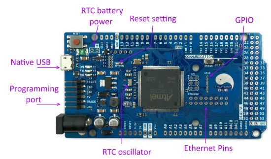

# TAIJIUINO Due R3S — Compatible with Arduino Due

**Elechouse** · ATSAM3X8E

Revision: R3S

Coverage: Supporting references; complete physical pinout still needed

[Browse all manufacturers](../../../../BROWSE.md) · [Devices & IoT](../../../../DEVICES.md) · [Open in the browser guide](https://valleytech-black-wire-guide.pages.dev/?board=elechouse-taijiuino-due-r3s)

Architecture: **ARM**

## Datasheets and original documentation

Board datasheet: **not yet recorded**. Visual reference: **available**.

[Original publisher / manufacturer documentation](https://www.elechouse.com/product/taijiuino-due-r3s-compatible-with-arduino-due/)

- **product-page / board**: [Exact product specifications and downloads](https://www.elechouse.com/product/taijiuino-due-r3s-compatible-with-arduino-due/) · online

Source identity and visual type reviewed; electrical limits and pin assignments have not been independently bench-verified. Match the exact PCB, connector orientation and interface mode. TAIJIUINO R3S exposes additional Ethernet and GPIO interfaces. A generic Arduino Due pinout is not substituted for the exact-board map.

[Documentation coverage and remaining gaps](../../../../DOCUMENTATION.md)

## Specifications and hardware documentation

- [Original hardware documentation](https://www.elechouse.com/product/taijiuino-due-r3s-compatible-with-arduino-due/)

## TAIJIUINO Due R3S — Compatible with Arduino Due — hardware identification and visible labels

**board labeling image** · Source image / document inspected; independent electrical review pending · PNG

[Open original reference](../../../../library/media/7f38a5c6981d6ac4bfe3d87994d7fb4c673d51c7b36b1549f5218aace268e76b.png)

**Credit and rights:** Elechouse / original diagram and document contributors. Asset-specific redistribution and print rights are not established. Black Wire's editorial license does not relicense this artwork.. Source/manufacturer: Elechouse.

[Source 1](https://www.elechouse.com/wp-content/uploads/2022/04/R3S.png) · [Source 2](https://www.elechouse.com/product/taijiuino-due-r3s-compatible-with-arduino-due/)

Source identity and visual type reviewed; electrical limits and pin assignments have not been independently bench-verified. Match the exact PCB, connector orientation and interface mode. TAIJIUINO R3S exposes additional Ethernet and GPIO interfaces. A generic Arduino Due pinout is not substituted for the exact-board map.

Image revision: R3S

SHA-256: `7f38a5c6981d6ac4bfe3d87994d7fb4c673d51c7b36b1549f5218aace268e76b`

Pin assignments have not been independently electrically verified. Check board revision before wiring.
