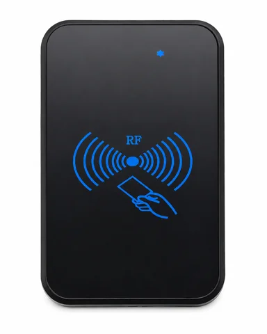
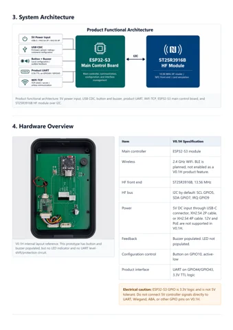
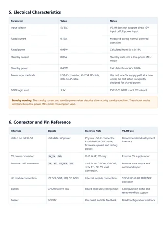
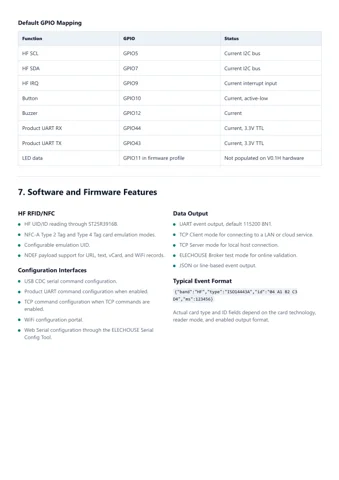

# ELECHOUSE Network RFID Reader V0.1H

**Elechouse** · ESP32-S3 / ST25R3916B

Revision: V0.1H development kit

Coverage: Supporting references; complete physical pinout still needed

[Browse all manufacturers](../../../../BROWSE.md) · [Devices & IoT](../../../../DEVICES.md) · [Open in the browser guide](https://valleytech-black-wire-guide.pages.dev/?board=elechouse-network-rfid-v01h)

Device category: **Controllers & instruments**

Source identity and visual type reviewed; electrical limits and pin assignments have not been independently bench-verified. Match the exact PCB, connector orientation and interface mode. V0.1H is a development kit. 12 V, PoE, LF 125 kHz and production Wiegand/ABA conditioning are roadmap items, not V0.1H capabilities. The saved guide provides GPIO functions but not a complete physical connector orientation map.

Architecture: **Xtensa**

## Datasheets and original documentation

Board datasheet: **recorded**. Visual reference: **available**.

[Original publisher / manufacturer documentation](https://www.elechouse.com/product/network-rfid-reader-v01h/)

- **product-page / board**: [Exact product specifications and downloads](https://www.elechouse.com/product/network-rfid-reader-v01h/) · online
- **datasheet / board**: [Product Overview PDF](https://www.elechouse.com/docs/network-rfid-reader-v01h/downloads/ELECHOUSE_Network_RFID_Reader_V0_1H_Product_Overview_EN.pdf) · [saved document](../../../../library/media/6fda5f114529f5e7d7bc7a84b1aaa4320bab22ade0d3793b42b68006ad93257f.pdf)
- **schematic / board**: [Mainboard Schematic PDF](https://www.elechouse.com/docs/network-rfid-reader-v01h/downloads/ELECHOUSE_Network_RFID_Reader_Mainboard_SCH.pdf) · [saved document](../../../../library/media/b36402c4feafc09d716baebfffc668db202908f900a54e510b4bfda4b102a559.pdf)

Source identity and visual type reviewed; electrical limits and pin assignments have not been independently bench-verified. Match the exact PCB, connector orientation and interface mode. V0.1H is a development kit. 12 V, PoE, LF 125 kHz and production Wiegand/ABA conditioning are roadmap items, not V0.1H capabilities. The saved guide provides GPIO functions but not a complete physical connector orientation map.

[Documentation coverage and remaining gaps](../../../../DOCUMENTATION.md)

## Specifications and hardware documentation

- [Original hardware documentation](https://www.elechouse.com/product/network-rfid-reader-v01h/)

## ELECHOUSE Network RFID Reader V0.1H — hardware identification and visible labels

**product photograph** · Source image / document inspected; independent electrical review pending · JPG

[Open original reference](../../../../library/media/f4e47bc1dfc8d0c46e504ef10ebd6d3935b85380fc1e3ebaff6ca51de5ce1703.jpg)

**Credit and rights:** Elechouse / original diagram and document contributors. Asset-specific redistribution and print rights are not established. Black Wire's editorial license does not relicense this artwork.. Source/manufacturer: Elechouse.

[Source 1](https://www.elechouse.com/wp-content/uploads/2026/07/product_front_enclosure.jpg) · [Source 2](https://www.elechouse.com/product/network-rfid-reader-v01h/)

Source identity and visual type reviewed; electrical limits and pin assignments have not been independently bench-verified. Match the exact PCB, connector orientation and interface mode. V0.1H is a development kit. 12 V, PoE, LF 125 kHz and production Wiegand/ABA conditioning are roadmap items, not V0.1H capabilities. The saved guide provides GPIO functions but not a complete physical connector orientation map.

Image revision: V0.1H development kit

SHA-256: `f4e47bc1dfc8d0c46e504ef10ebd6d3935b85380fc1e3ebaff6ca51de5ce1703`

## Product Overview PDF

**original reference PDF** · Source image / document inspected; independent electrical review pending · PDF

[Open original reference](../../../../library/media/6fda5f114529f5e7d7bc7a84b1aaa4320bab22ade0d3793b42b68006ad93257f.pdf)

**Credit and rights:** Elechouse / original diagram and document contributors. Asset-specific redistribution and print rights are not established. Black Wire's editorial license does not relicense this artwork.. Source/manufacturer: Elechouse.

[Source 1](https://www.elechouse.com/docs/network-rfid-reader-v01h/downloads/ELECHOUSE_Network_RFID_Reader_V0_1H_Product_Overview_EN.pdf) · [Source 2](https://www.elechouse.com/docs/network-rfid-reader-v01h/product-overview/)

Source identity and visual type reviewed; electrical limits and pin assignments have not been independently bench-verified. Match the exact PCB, connector orientation and interface mode. V0.1H is a development kit. 12 V, PoE, LF 125 kHz and production Wiegand/ABA conditioning are roadmap items, not V0.1H capabilities. The saved guide provides GPIO functions but not a complete physical connector orientation map.

Image revision: V0.1H development kit

SHA-256: `6fda5f114529f5e7d7bc7a84b1aaa4320bab22ade0d3793b42b68006ad93257f`

## Mainboard Schematic PDF

**original reference PDF** · Source image / document inspected; independent electrical review pending · PDF

[Open original reference](../../../../library/media/b36402c4feafc09d716baebfffc668db202908f900a54e510b4bfda4b102a559.pdf)

**Credit and rights:** Elechouse / original diagram and document contributors. Asset-specific redistribution and print rights are not established. Black Wire's editorial license does not relicense this artwork.. Source/manufacturer: Elechouse.

[Source 1](https://www.elechouse.com/docs/network-rfid-reader-v01h/downloads/ELECHOUSE_Network_RFID_Reader_Mainboard_SCH.pdf) · [Source 2](https://www.elechouse.com/docs/network-rfid-reader-v01h/product-overview/)

Source identity and visual type reviewed; electrical limits and pin assignments have not been independently bench-verified. Match the exact PCB, connector orientation and interface mode. V0.1H is a development kit. 12 V, PoE, LF 125 kHz and production Wiegand/ABA conditioning are roadmap items, not V0.1H capabilities. The saved guide provides GPIO functions but not a complete physical connector orientation map.

Image revision: V0.1H development kit

SHA-256: `b36402c4feafc09d716baebfffc668db202908f900a54e510b4bfda4b102a559`

## ELECHOUSE Network RFID Reader V0.1H — board labeling image — original PDF page 3

**board labeling image** · Source image / document inspected; independent electrical review pending · PNG

[Open original reference](../../../../library/media/f3f70561ce513ed13fb1ecf31a4a23992c750fe8f003062363339cfbb40ef3f8.png)

**Credit and rights:** Elechouse / original diagram and document contributors. Asset-specific redistribution and print rights are not established. Black Wire's editorial license does not relicense this artwork.. Source/manufacturer: Elechouse.

[Source 1](https://www.elechouse.com/docs/network-rfid-reader-v01h/downloads/ELECHOUSE_Network_RFID_Reader_V0_1H_Product_Overview_EN.pdf) · [Source 2](https://www.elechouse.com/docs/network-rfid-reader-v01h/product-overview/)

Source identity and visual type reviewed; electrical limits and pin assignments have not been independently bench-verified. Match the exact PCB, connector orientation and interface mode. V0.1H is a development kit. 12 V, PoE, LF 125 kHz and production Wiegand/ABA conditioning are roadmap items, not V0.1H capabilities. The saved guide provides GPIO functions but not a complete physical connector orientation map.

Image revision: V0.1H development kit

SHA-256: `f3f70561ce513ed13fb1ecf31a4a23992c750fe8f003062363339cfbb40ef3f8`

## ELECHOUSE Network RFID Reader V0.1H — connector reference — original PDF page 4

**connector reference** · Source image / document inspected; independent electrical review pending · PNG

[Open original reference](../../../../library/media/737e4081a002e632ddce1a7a0a34837f71719fff9c334fca1e17c2526a07f6d8.png)

**Credit and rights:** Elechouse / original diagram and document contributors. Asset-specific redistribution and print rights are not established. Black Wire's editorial license does not relicense this artwork.. Source/manufacturer: Elechouse.

[Source 1](https://www.elechouse.com/docs/network-rfid-reader-v01h/downloads/ELECHOUSE_Network_RFID_Reader_V0_1H_Product_Overview_EN.pdf) · [Source 2](https://www.elechouse.com/docs/network-rfid-reader-v01h/product-overview/)

Source identity and visual type reviewed; electrical limits and pin assignments have not been independently bench-verified. Match the exact PCB, connector orientation and interface mode. V0.1H is a development kit. 12 V, PoE, LF 125 kHz and production Wiegand/ABA conditioning are roadmap items, not V0.1H capabilities. The saved guide provides GPIO functions but not a complete physical connector orientation map.

Image revision: V0.1H development kit

SHA-256: `737e4081a002e632ddce1a7a0a34837f71719fff9c334fca1e17c2526a07f6d8`

## ELECHOUSE Network RFID Reader V0.1H — pin function reference — original PDF page 5

**pin function reference** · Source image / document inspected; independent electrical review pending · PNG

[Open original reference](../../../../library/media/ee8e091f62acd1bf73acd7188a512c15121f60c9ad9c5bc90f1d641ed0b08e77.png)

**Credit and rights:** Elechouse / original diagram and document contributors. Asset-specific redistribution and print rights are not established. Black Wire's editorial license does not relicense this artwork.. Source/manufacturer: Elechouse.

[Source 1](https://www.elechouse.com/docs/network-rfid-reader-v01h/downloads/ELECHOUSE_Network_RFID_Reader_V0_1H_Product_Overview_EN.pdf) · [Source 2](https://www.elechouse.com/docs/network-rfid-reader-v01h/product-overview/)

Source identity and visual type reviewed; electrical limits and pin assignments have not been independently bench-verified. Match the exact PCB, connector orientation and interface mode. V0.1H is a development kit. 12 V, PoE, LF 125 kHz and production Wiegand/ABA conditioning are roadmap items, not V0.1H capabilities. The saved guide provides GPIO functions but not a complete physical connector orientation map.

Image revision: V0.1H development kit

SHA-256: `ee8e091f62acd1bf73acd7188a512c15121f60c9ad9c5bc90f1d641ed0b08e77`

Pin assignments have not been independently electrically verified. Check board revision before wiring.
