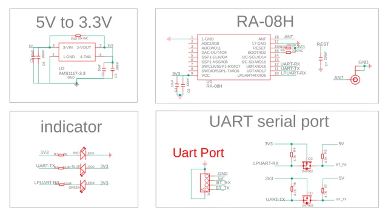

# Crowtail LoRa RA-08H

**Elecrow** · ASR6601

Revision: PCB revision not established

Coverage: Supporting references; complete physical pinout still needed

[Browse all manufacturers](../../../../BROWSE.md) · [Devices & IoT](../../../../DEVICES.md) · [Open in the browser guide](https://valleytech-black-wire-guide.pages.dev/?board=elecrow-crowtail-ra08h)

## Datasheets and original documentation

Board datasheet: **not yet recorded**. Visual reference: **available**.

[Original manufacturer / project documentation](https://www.elecrow.com/wiki/crowtail--lora-ra-08h.html)

- **hardware-guide / board**: [Manufacturer specifications and interface documentation](https://www.elecrow.com/wiki/crowtail--lora-ra-08h.html) · online
- **datasheet / component**: [Ai-Thinker RA-08H component module datasheet](https://www.elecrow.com/wiki/image/1/1b/Ra-08h_v1.1.0_specification.pdf) · online

Source identity and visual scope reviewed. Pin assignments and electrical limits are not independently bench-verified. Match the exact PCB revision, connector view and populated options. Module pin numbers do not establish carrier-header numbering. Follow the exact module or carrier schematic. GPIO-group labels and pin tables are explicitly separate from full physical maps.

[Documentation coverage and remaining gaps](../../../../DOCUMENTATION.md)

## Crowtail LoRa RA-08H — connector reference

**schematic image** · Source visual inspected; independent electrical and all-pin completeness review pending · PNG

[Open original reference](../../../../library/media/f46ca278a1eb1cbe7baa7139384c2ea5d5a05eafb78a4b131c836693a96d7978.png)

**Credit and rights:** Elecrow / original artwork contributors. Asset-specific redistribution and print rights are not established; Black Wire licenses do not relicense this source artwork.. Source/manufacturer: Elecrow.

[Source 1](https://www.elecrow.com/wiki/image/2/24/RA-08H.png) · [Source 2](https://www.elecrow.com/wiki/crowtail--lora-ra-08h.html)

Source identity and visual scope reviewed. Pin assignments and electrical limits are not independently bench-verified. Match the exact PCB revision, connector view and populated options. Module pin numbers do not establish carrier-header numbering. Follow the exact module or carrier schematic. GPIO-group labels and pin tables are explicitly separate from full physical maps.

Image revision: PCB revision not established

SHA-256: `f46ca278a1eb1cbe7baa7139384c2ea5d5a05eafb78a4b131c836693a96d7978`

Pin assignments have not been independently electrically verified. Check board revision before wiring.
