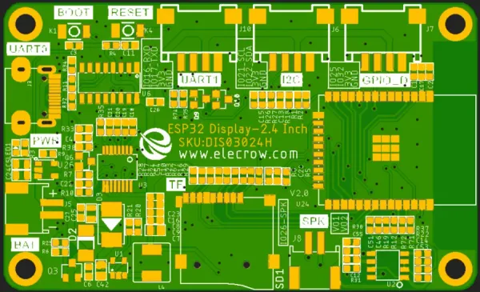

# CrowPanel ESP32 HMI 2.4-inch Display

**Elecrow** · ESP32 original

Revision: V2.0 printed on PCB diagram  
Coverage: Pinout image collected

[Browse all manufacturers](../../../../BROWSE.md) · [Desktop app](https://github.com/valleytechsolutions/black-wire-desktop)

## Board pin map

**pinout image** · Reviewed source · WEBP

[Open original reference](../../../../library/media/b6f80fb7ee30a3514fdd19123664ab2781033938251e0c0406c018ede4cc017a.webp)

**Credit and rights:** Not established; source attribution retained. Source/manufacturer: Elecrow.

[Source 1](https://www.elecrow.com/wiki/assets/images/CrowPanel_ESP32_HMI_2.4-inch_Display/CrowPanel-ESP32-2-4inch-pinout.webp) · [Source 2](https://www.elecrow.com/wiki/esp32-display-242727-intelligent-touch-screen-wi-fi26ble-240320-hmi-display.html)

Manufacturer image preserved. Match the depicted board and revision before use.

SHA-256: `b6f80fb7ee30a3514fdd19123664ab2781033938251e0c0406c018ede4cc017a`

Pin assignments have not been independently electrically verified. Check board revision before wiring.
