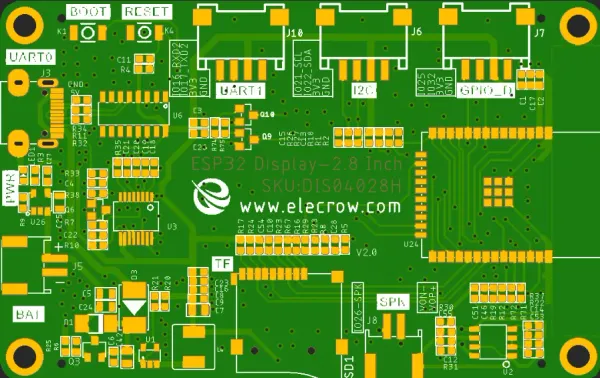

# CrowPanel ESP32 HMI 2.8-inch Display

**Elecrow** · ESP32 original

Revision: V2.0 printed on PCB diagram  
Coverage: Pinout image collected

[Browse all manufacturers](../../../../BROWSE.md) · [Desktop app](https://github.com/valleytechsolutions/black-wire-desktop)

## Board pin map

**pinout image** · Reviewed source · WEBP

[Open original reference](../../../../library/media/158e438437185b46f040d8e3ab0cd86bce996ee42d2ecf9ec30d769dc7e6eec0.webp)

**Credit and rights:** Not established; source attribution retained. Source/manufacturer: Elecrow.

[Source 1](https://www.elecrow.com/wiki/assets/images/CrowPanel_ESP32_HMI_2.8-inch_Display/CrowPanel-ESP32-2-8inch-pinout.webp) · [Source 2](https://www.elecrow.com/wiki/esp32-display-282727-intelligent-touch-screen-wi-fi26ble-240320-hmi-display.html)

Manufacturer image preserved. Match the depicted board and revision before use.

SHA-256: `158e438437185b46f040d8e3ab0cd86bce996ee42d2ecf9ec30d769dc7e6eec0`

Pin assignments have not been independently electrically verified. Check board revision before wiring.
