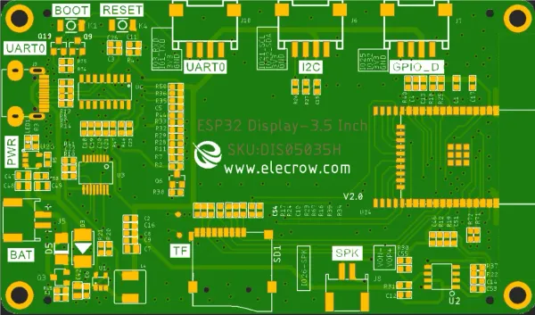

# CrowPanel ESP32 HMI 3.5-inch Display

**Elecrow** · ESP32 original

Revision: V2.0 printed on PCB diagram  
Coverage: Pinout image collected

[Browse all manufacturers](../../../../BROWSE.md) · [Desktop app](https://github.com/valleytechsolutions/black-wire-desktop)

## Board pin map

**pinout image** · Reviewed source · WEBP

[Open original reference](../../../../library/media/f2bda2ae9694bca808132bc8ce6249bba49f7e16ca341c553f60f42482d3e9ea.webp)

**Credit and rights:** Not established; source attribution retained. Source/manufacturer: Elecrow.

[Source 1](https://www.elecrow.com/wiki/assets/images/CrowPanel_ESP32_HMI_3.5-inch_Display/CrowPanel-ESP32-3-5inch-pinout.webp) · [Source 2](https://www.elecrow.com/wiki/esp32-display-352727-intelligent-touch-screen-wi-fi26ble-320480-hmi-display.html)

Manufacturer image preserved. Match the depicted board and revision before use.

SHA-256: `f2bda2ae9694bca808132bc8ce6249bba49f7e16ca341c553f60f42482d3e9ea`

Pin assignments have not been independently electrically verified. Check board revision before wiring.
