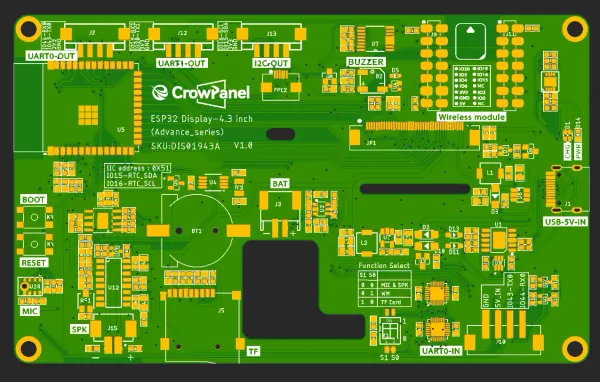

# CrowPanel Advance 4.3-HMI ESP32 AI Display

**Elecrow** · ESP32-S3

Revision: Advance series V1.0 printed on PCB diagram  
Coverage: Pinout image collected

[Browse all manufacturers](../../../../BROWSE.md) · [Desktop app](https://github.com/valleytechsolutions/black-wire-desktop)

## Board pin map

**pinout image** · Reviewed source · WEBP

[Open original reference](../../../../library/media/4b12ed4bc05b9a5e7dd3894b3c1f3d54969beb7386a2226e1cee2116714c7532.webp)

**Credit and rights:** Not established; source attribution retained. Source/manufacturer: Elecrow.

[Source 1](https://www.elecrow.com/wiki/assets/images/CrowPanel_Advance_4.3-HMI_ESP32_AI_Display/advance-4.3-1.webp) · [Source 2](https://www.elecrow.com/wiki/CrowPanel_Advance_4.3-HMI_ESP32_AI_Display.html)

Manufacturer image preserved. Match the depicted board and revision before use.

SHA-256: `4b12ed4bc05b9a5e7dd3894b3c1f3d54969beb7386a2226e1cee2116714c7532`

Pin assignments have not been independently electrically verified. Check board revision before wiring.
