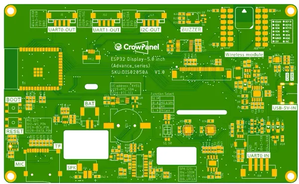

# CrowPanel Advance 5.0-HMI ESP32 AI Display

**Elecrow** · ESP32-S3

Revision: Advance series V1.0 printed on PCB diagram  
Coverage: Pinout image collected

[Browse all manufacturers](../../../../BROWSE.md) · [Desktop app](https://github.com/valleytechsolutions/black-wire-desktop)

## Board pin map

**pinout image** · Reviewed source · WEBP

[Open original reference](../../../../library/media/159aee1671d806b9a53fdd3af0f8b28603938cf66064bdd5296c9b47708e4202.webp)

**Credit and rights:** Not established; source attribution retained. Source/manufacturer: Elecrow.

[Source 1](https://www.elecrow.com/wiki/assets/images/CrowPanel_Advance_5.0-HMI_ESP32_AI_Display/advance-5.0-1.webp) · [Source 2](https://www.elecrow.com/wiki/CrowPanel_Advance_5.0-HMI_ESP32_AI_Display.html)

Manufacturer image preserved. Match the depicted board and revision before use.

SHA-256: `159aee1671d806b9a53fdd3af0f8b28603938cf66064bdd5296c9b47708e4202`

Pin assignments have not been independently electrically verified. Check board revision before wiring.
