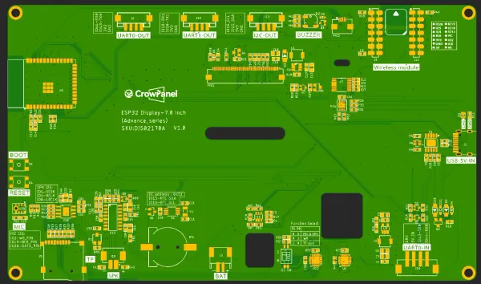

# CrowPanel Advance 7.0-HMI ESP32 AI Display

**Elecrow** · ESP32-S3

Revision: Advance series V1.0 printed on PCB diagram  
Coverage: Pinout image collected

[Browse all manufacturers](../../../../BROWSE.md) · [Desktop app](https://github.com/valleytechsolutions/black-wire-desktop)

## Board pin map

**pinout image** · Reviewed source · WEBP

[Open original reference](../../../../library/media/3cd890448c5da8d4fb98fd462c830437e9d374cf4f318e65926b233679b037f5.webp)

**Credit and rights:** Not established; source attribution retained. Source/manufacturer: Elecrow.

[Source 1](https://www.elecrow.com/wiki/assets/images/ESP32_Display-7.0_inch%28Advance_Series%29wiki/advance-7.0-1.webp) · [Source 2](https://www.elecrow.com/wiki/ESP32_Display-7.0_inch%28Advance_Series%29wiki.html)

Manufacturer image preserved. Match the depicted board and revision before use.

SHA-256: `3cd890448c5da8d4fb98fd462c830437e9d374cf4f318e65926b233679b037f5`

Pin assignments have not been independently electrically verified. Check board revision before wiring.
