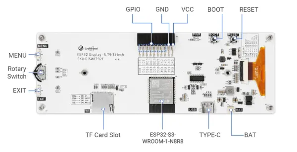

# CrowPanel ESP32 E-Paper HMI 5.79-inch Display

**Elecrow** · ESP32-S3

Revision: Not identified  
Coverage: Board labels only; pinout needed

[Browse all manufacturers](../../../../BROWSE.md) · [Desktop app](https://github.com/valleytechsolutions/black-wire-desktop)

## Board connector locations

**board labeling image** · Reviewed source · WEBP

[Open original reference](../../../../library/media/2939c7182bdad8d9cd4a6cc0ea36be61daa3fb7d464f0a6a2b643c44ca522b63.webp)

**Credit and rights:** Not established; source attribution retained. Source/manufacturer: Elecrow.

[Source 1](https://www.elecrow.com/wiki/assets/images/CrowPanel_ESP32_E-paper_5.79-inch_HMI_Display/ESP32-EPAPER-5.79inch-pinout.webp) · [Source 2](https://www.elecrow.com/wiki/CrowPanel_ESP32_E-paper_5.79-inch_HMI_Display.html)

Manufacturer image preserved. Match the depicted board and revision before use.

SHA-256: `2939c7182bdad8d9cd4a6cc0ea36be61daa3fb7d464f0a6a2b643c44ca522b63`

Pin assignments have not been independently electrically verified. Check board revision before wiring.
