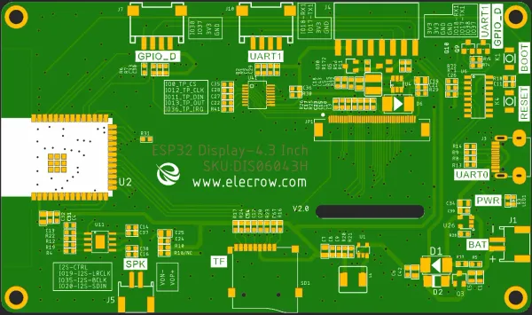

# CrowPanel ESP32 HMI 4.3-inch Display

**Elecrow** · ESP32-S3

Revision: V2.0 printed on PCB diagram  
Coverage: Pinout image collected

[Browse all manufacturers](../../../../BROWSE.md) · [Desktop app](https://github.com/valleytechsolutions/black-wire-desktop)

## Board pin map

**pinout image** · Reviewed source · WEBP

[Open original reference](../../../../library/media/6d057e6258a06a842b15a7872226fd82c433dde2c73accfa622a5d712e97caeb.webp)

**Credit and rights:** Not established; source attribution retained. Source/manufacturer: Elecrow.

[Source 1](https://www.elecrow.com/wiki/assets/images/CrowPanel_ESP32_HMI_4.3-inch_Display/CrowPanel-ESP32-4.3-inch-pinout.webp) · [Source 2](https://www.elecrow.com/wiki/esp32-display-432727-intelligent-touch-screen-wi-fi26ble-480272-hmi-display.html)

Manufacturer image preserved. Match the depicted board and revision before use.

SHA-256: `6d057e6258a06a842b15a7872226fd82c433dde2c73accfa622a5d712e97caeb`

Pin assignments have not been independently electrically verified. Check board revision before wiring.
