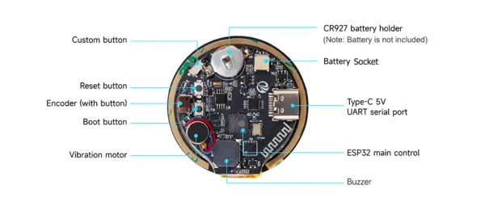

# CrowPanel ESP32 1.28-inch Round Display

**Elecrow** · ESP32

Revision: Not identified  
Coverage: Board labels only; pinout needed

[Browse all manufacturers](../../../../BROWSE.md) · [Desktop app](https://github.com/valleytechsolutions/black-wire-desktop)

## Board connector locations

**board labeling image** · Reviewed source · WEBP

[Open original reference](../../../../library/media/96752f5c6cb8b9f76fc06fb6feb7f38ca45e6e4896247a2185322e3ef3d7025e.webp)

**Credit and rights:** Not established; source attribution retained. Source/manufacturer: Elecrow.

[Source 1](https://www.elecrow.com/wiki/assets/images/CrowPanel_ESP32_1.28-inch_Round_Display/interface.webp) · [Source 2](https://www.elecrow.com/wiki/CrowPanel_ESP32_1.28-inch_Round_Display.html)

Manufacturer image preserved. Match the depicted board and revision before use.

SHA-256: `96752f5c6cb8b9f76fc06fb6feb7f38ca45e6e4896247a2185322e3ef3d7025e`

Pin assignments have not been independently electrically verified. Check board revision before wiring.
