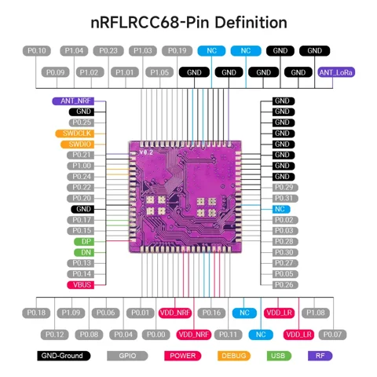

# nRFLRCC68 wireless transceiver module

**Elecrow** · nRF52840 / LLCC68

Revision: PCB revision not established

Coverage: Physical source pinout available; independent completeness review pending

[Browse all manufacturers](../../../../BROWSE.md) · [Devices & IoT](../../../../DEVICES.md) · [Open in the browser guide](https://valleytech-black-wire-guide.pages.dev/?board=elecrow-nrflrcc68)

## Datasheets and original documentation

Board datasheet: **recorded**. Visual reference: **available**.

[Original manufacturer / project documentation](https://www.elecrow.com/wiki/Elecrow_NRFLRCC68_Wireless_Transceiver_Module.html)

- **hardware-guide / board**: [Manufacturer specifications and interface documentation](https://www.elecrow.com/wiki/Elecrow_NRFLRCC68_Wireless_Transceiver_Module.html) · online
- **datasheet / board**: [Datasheet/nRFLRCC68_Datasheet_V1.0.pdf](https://raw.githubusercontent.com/Elecrow-RD/Elecrow-nRFLRCC68-Wireless-Transceiver-Module/d65d793fe58af834684eb884a0cb727e3c511107/Datasheet/nRFLRCC68_Datasheet_V1.0.pdf) · [saved document](../../../../library/media/e2df77fab1eec6837e2821656555db5a430de462e835a571b145c3a7ff27218c.pdf)

Source identity and visual scope reviewed. Pin assignments and electrical limits are not independently bench-verified. Match the exact PCB revision, connector view and populated options. Module pin numbers do not establish carrier-header numbering. Follow the exact module or carrier schematic. GPIO-group labels and pin tables are explicitly separate from full physical maps.

[Documentation coverage and remaining gaps](../../../../DOCUMENTATION.md)

## nRFLRCC68 wireless transceiver module — physical module pin map

**pinout image** · Source visual inspected; independent electrical and all-pin completeness review pending · WEBP

[Open original reference](../../../../library/media/9133f76b449e4d58214abd092d65194a2c83af07cc6cdbc3de04c4e9300fc9ec.webp)

**Credit and rights:** Elecrow / original artwork contributors. Asset-specific redistribution and print rights are not established; Black Wire licenses do not relicense this source artwork.. Source/manufacturer: Elecrow.

[Source 1](https://www.elecrow.com/wiki/assets/images/Elecrow_NRFLRCC68_Wireless_Transceiver_Module/nrflrcc68_wireless_transceiver_module2.webp) · [Source 2](https://www.elecrow.com/wiki/Elecrow_NRFLRCC68_Wireless_Transceiver_Module.html)

Source identity and visual scope reviewed. Pin assignments and electrical limits are not independently bench-verified. Match the exact PCB revision, connector view and populated options. Module pin numbers do not establish carrier-header numbering. Follow the exact module or carrier schematic. GPIO-group labels and pin tables are explicitly separate from full physical maps.

Image revision: PCB revision not established

SHA-256: `9133f76b449e4d58214abd092d65194a2c83af07cc6cdbc3de04c4e9300fc9ec`

## Datasheet/nRFLRCC68_Datasheet_V1.0.pdf

**original reference PDF** · Source visual inspected; independent electrical and all-pin completeness review pending · PDF

[Open original reference](../../../../library/media/e2df77fab1eec6837e2821656555db5a430de462e835a571b145c3a7ff27218c.pdf)

**Credit and rights:** Elecrow / original artwork contributors. Asset-specific redistribution and print rights are not established; Black Wire licenses do not relicense this source artwork.. Source/manufacturer: Elecrow.

[Source 1](https://raw.githubusercontent.com/Elecrow-RD/Elecrow-nRFLRCC68-Wireless-Transceiver-Module/d65d793fe58af834684eb884a0cb727e3c511107/Datasheet/nRFLRCC68_Datasheet_V1.0.pdf) · [Source 2](https://www.elecrow.com/wiki/Elecrow_NRFLRCC68_Wireless_Transceiver_Module.html)

Source identity and visual scope reviewed. Pin assignments and electrical limits are not independently bench-verified. Match the exact PCB revision, connector view and populated options. Module pin numbers do not establish carrier-header numbering. Follow the exact module or carrier schematic. GPIO-group labels and pin tables are explicitly separate from full physical maps.

Image revision: PCB revision not established

SHA-256: `e2df77fab1eec6837e2821656555db5a430de462e835a571b145c3a7ff27218c`

Pin assignments have not been independently electrically verified. Check board revision before wiring.
