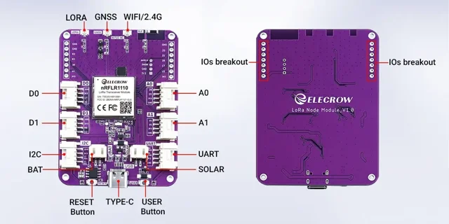

# nRFLR1110 LoRa node expansion board

**Elecrow** · nRF52840 / LR1110

Revision: PCB revision not established

Coverage: Supporting references; complete physical pinout still needed

[Browse all manufacturers](../../../../BROWSE.md) · [Devices & IoT](../../../../DEVICES.md) · [Open in the browser guide](https://valleytech-black-wire-guide.pages.dev/?board=elecrow-nrflr1110-node)

## Datasheets and original documentation

Board datasheet: **not yet recorded**. Visual reference: **available**.

[Original manufacturer / project documentation](https://www.elecrow.com/wiki/LoRa_Node_Expansion_Board-nRFLR1110_Integrates_nRF52840_for_Long_Range_Communication_Support_GNSS_Position.html)

- **hardware-guide / board**: [Manufacturer specifications and interface documentation](https://www.elecrow.com/wiki/LoRa_Node_Expansion_Board-nRFLR1110_Integrates_nRF52840_for_Long_Range_Communication_Support_GNSS_Position.html) · online
- **schematic / board**: [Eagle_SCH&PCB/LoRa Node Module_V1.0.pdf](https://raw.githubusercontent.com/Elecrow-RD/LoRa_Node_Expansion_Board_nRFLR1110_Integrates_nRF52840/66e8f4660df58498d1e0b309b5feead998bc39d0/Eagle_SCH%26PCB/LoRa%20Node%20Module_V1.0.pdf) · [saved document](../../../../library/media/2d676b89ef7c994c6f496342893e1e3f3bb38418c5a0714c9455ed69f208f8ee.pdf)

Source identity and visual scope reviewed. Pin assignments and electrical limits are not independently bench-verified. Match the exact PCB revision, connector view and populated options. Module pin numbers do not establish carrier-header numbering. Follow the exact module or carrier schematic. GPIO-group labels and pin tables are explicitly separate from full physical maps.

[Documentation coverage and remaining gaps](../../../../DOCUMENTATION.md)

## nRFLR1110 LoRa node expansion board — connector reference

**board labeling image** · Source visual inspected; independent electrical and all-pin completeness review pending · WEBP

[Open original reference](../../../../library/media/4b6d8252353c95a8665443e44b8c437f202f3c144cdacffd633404aa146209b1.webp)

**Credit and rights:** Elecrow / original artwork contributors. Asset-specific redistribution and print rights are not established; Black Wire licenses do not relicense this source artwork.. Source/manufacturer: Elecrow.

[Source 1](https://www.elecrow.com/wiki/assets/images/LoRa_Node_Expansion_Board-nRFLR1110_Integrates_nRF52840_for_Long_Range_Communication_Support_GNSS_Position/hardware_overview_of_LoRa_Node_nRFLR1110_Board_1.webp) · [Source 2](https://www.elecrow.com/wiki/LoRa_Node_Expansion_Board-nRFLR1110_Integrates_nRF52840_for_Long_Range_Communication_Support_GNSS_Position.html)

Source identity and visual scope reviewed. Pin assignments and electrical limits are not independently bench-verified. Match the exact PCB revision, connector view and populated options. Module pin numbers do not establish carrier-header numbering. Follow the exact module or carrier schematic. GPIO-group labels and pin tables are explicitly separate from full physical maps.

Image revision: PCB revision not established

SHA-256: `4b6d8252353c95a8665443e44b8c437f202f3c144cdacffd633404aa146209b1`

## Eagle_SCH&PCB/LoRa Node Module_V1.0.pdf

**original reference PDF** · Source visual inspected; independent electrical and all-pin completeness review pending · PDF

[Open original reference](../../../../library/media/2d676b89ef7c994c6f496342893e1e3f3bb38418c5a0714c9455ed69f208f8ee.pdf)

**Credit and rights:** Elecrow / original artwork contributors. Asset-specific redistribution and print rights are not established; Black Wire licenses do not relicense this source artwork.. Source/manufacturer: Elecrow.

[Source 1](https://raw.githubusercontent.com/Elecrow-RD/LoRa_Node_Expansion_Board_nRFLR1110_Integrates_nRF52840/66e8f4660df58498d1e0b309b5feead998bc39d0/Eagle_SCH%26PCB/LoRa%20Node%20Module_V1.0.pdf) · [Source 2](https://www.elecrow.com/wiki/LoRa_Node_Expansion_Board-nRFLR1110_Integrates_nRF52840_for_Long_Range_Communication_Support_GNSS_Position.html)

Source identity and visual scope reviewed. Pin assignments and electrical limits are not independently bench-verified. Match the exact PCB revision, connector view and populated options. Module pin numbers do not establish carrier-header numbering. Follow the exact module or carrier schematic. GPIO-group labels and pin tables are explicitly separate from full physical maps.

Image revision: PCB revision not established

SHA-256: `2d676b89ef7c994c6f496342893e1e3f3bb38418c5a0714c9455ed69f208f8ee`

Pin assignments have not been independently electrically verified. Check board revision before wiring.
