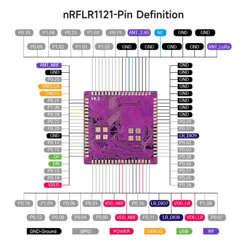

# nRFLR1121 wireless transceiver module

**Elecrow** · nRF52840 / LR1121

Revision: PCB revision not established

Coverage: Physical source pinout available; independent completeness review pending

[Browse all manufacturers](../../../../BROWSE.md) · [Devices & IoT](../../../../DEVICES.md) · [Open in the browser guide](https://valleytech-black-wire-guide.pages.dev/?board=elecrow-nrflr1121)

## Datasheets and original documentation

Board datasheet: **recorded**. Visual reference: **available**.

[Original manufacturer / project documentation](https://www.elecrow.com/wiki/Elecrow_NRFLR1121_Wireless_Transceiver_Module.html)

- **hardware-guide / board**: [Manufacturer specifications and interface documentation](https://www.elecrow.com/wiki/Elecrow_NRFLR1121_Wireless_Transceiver_Module.html) · online
- **datasheet / board**: [Datasheet/nRFLR1121_Datasheet_V1.0.pdf](https://raw.githubusercontent.com/Elecrow-RD/Elecrow-nRFLR1121-Wireless-Transceiver-Module/a09c7d692838ea93b4b32a0f5da617c5fb627ce5/Datasheet/nRFLR1121_Datasheet_V1.0.pdf) · [saved document](../../../../library/media/82023574058a54c749b91a3bdd5f24d882fd652e862b831479831dda237e6600.pdf)

Source identity and visual scope reviewed. Pin assignments and electrical limits are not independently bench-verified. Match the exact PCB revision, connector view and populated options. Module pin numbers do not establish carrier-header numbering. Follow the exact module or carrier schematic. GPIO-group labels and pin tables are explicitly separate from full physical maps.

[Documentation coverage and remaining gaps](../../../../DOCUMENTATION.md)

## nRFLR1121 wireless transceiver module — physical module pin map

**pinout image** · Source visual inspected; independent electrical and all-pin completeness review pending · WEBP

[Open original reference](../../../../library/media/077921beb9b5293ef35330a58497dec283584f4ef11f1b844fa026d5555dd0dc.webp)

**Credit and rights:** Elecrow / original artwork contributors. Asset-specific redistribution and print rights are not established; Black Wire licenses do not relicense this source artwork.. Source/manufacturer: Elecrow.

[Source 1](https://www.elecrow.com/wiki/assets/images/Elecrow_NRFLR1121_Wireless_Transceiver_Module/nRFLR1121-Pin_Definition2.webp) · [Source 2](https://www.elecrow.com/wiki/Elecrow_NRFLR1121_Wireless_Transceiver_Module.html)

Source identity and visual scope reviewed. Pin assignments and electrical limits are not independently bench-verified. Match the exact PCB revision, connector view and populated options. Module pin numbers do not establish carrier-header numbering. Follow the exact module or carrier schematic. GPIO-group labels and pin tables are explicitly separate from full physical maps.

Image revision: PCB revision not established

SHA-256: `077921beb9b5293ef35330a58497dec283584f4ef11f1b844fa026d5555dd0dc`

## Datasheet/nRFLR1121_Datasheet_V1.0.pdf

**original reference PDF** · Source visual inspected; independent electrical and all-pin completeness review pending · PDF

[Open original reference](../../../../library/media/82023574058a54c749b91a3bdd5f24d882fd652e862b831479831dda237e6600.pdf)

**Credit and rights:** Elecrow / original artwork contributors. Asset-specific redistribution and print rights are not established; Black Wire licenses do not relicense this source artwork.. Source/manufacturer: Elecrow.

[Source 1](https://raw.githubusercontent.com/Elecrow-RD/Elecrow-nRFLR1121-Wireless-Transceiver-Module/a09c7d692838ea93b4b32a0f5da617c5fb627ce5/Datasheet/nRFLR1121_Datasheet_V1.0.pdf) · [Source 2](https://www.elecrow.com/wiki/Elecrow_NRFLR1121_Wireless_Transceiver_Module.html)

Source identity and visual scope reviewed. Pin assignments and electrical limits are not independently bench-verified. Match the exact PCB revision, connector view and populated options. Module pin numbers do not establish carrier-header numbering. Follow the exact module or carrier schematic. GPIO-group labels and pin tables are explicitly separate from full physical maps.

Image revision: PCB revision not established

SHA-256: `82023574058a54c749b91a3bdd5f24d882fd652e862b831479831dda237e6600`

Pin assignments have not been independently electrically verified. Check board revision before wiring.
