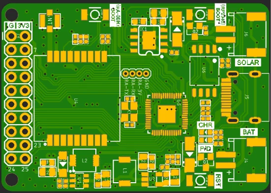
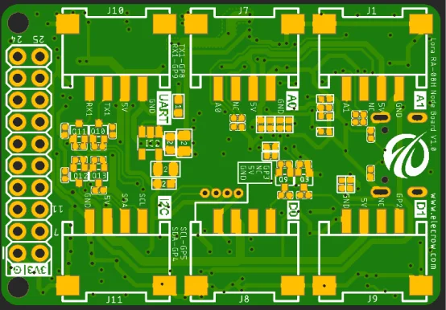

# LoRa RA-08H node board

**Elecrow** · RP2040 / ASR6601

Revision: PCB revision not established

Coverage: Supporting references; complete physical pinout still needed

[Browse all manufacturers](../../../../BROWSE.md) · [Devices & IoT](../../../../DEVICES.md) · [Open in the browser guide](https://valleytech-black-wire-guide.pages.dev/?board=elecrow-ra08h-node)

## Datasheets and original documentation

Board datasheet: **not yet recorded**. Visual reference: **available**.

[Original manufacturer / project documentation](https://www.elecrow.com/wiki/lora-ra-08h-node-board.html)

- **hardware-guide / board**: [Manufacturer specifications and interface documentation](https://www.elecrow.com/wiki/lora-ra-08h-node-board.html) · online

Source identity and visual scope reviewed. Pin assignments and electrical limits are not independently bench-verified. Match the exact PCB revision, connector view and populated options. Module pin numbers do not establish carrier-header numbering. Follow the exact module or carrier schematic. GPIO-group labels and pin tables are explicitly separate from full physical maps.

[Documentation coverage and remaining gaps](../../../../DOCUMENTATION.md)

## LoRa RA-08H node board — connector reference

**board labeling image** · Source visual inspected; independent electrical and all-pin completeness review pending · PNG

[Open original reference](../../../../library/media/95cde3ff81752cdb1c29b7e21d7ba2f63a99a3b2b8f4fa24bf9535eb8d3c8803.png)

**Credit and rights:** Elecrow / original artwork contributors. Asset-specific redistribution and print rights are not established; Black Wire licenses do not relicense this source artwork.. Source/manufacturer: Elecrow.

[Source 1](https://www.elecrow.com/wiki/image/0/0a/Lora_RA-08H_Node_1_1.png) · [Source 2](https://www.elecrow.com/wiki/lora-ra-08h-node-board.html)

Source identity and visual scope reviewed. Pin assignments and electrical limits are not independently bench-verified. Match the exact PCB revision, connector view and populated options. Module pin numbers do not establish carrier-header numbering. Follow the exact module or carrier schematic. GPIO-group labels and pin tables are explicitly separate from full physical maps.

Image revision: PCB revision not established

SHA-256: `95cde3ff81752cdb1c29b7e21d7ba2f63a99a3b2b8f4fa24bf9535eb8d3c8803`

## LoRa RA-08H node board — connector reference

**board labeling image** · Source visual inspected; independent electrical and all-pin completeness review pending · PNG

[Open original reference](../../../../library/media/a295f1381fafe7ca25a951030ba66446d222e099639d42a5b1873ea39433c644.png)

**Credit and rights:** Elecrow / original artwork contributors. Asset-specific redistribution and print rights are not established; Black Wire licenses do not relicense this source artwork.. Source/manufacturer: Elecrow.

[Source 1](https://www.elecrow.com/wiki/image/5/5a/Lora_RA-08H_Node_1_2.png) · [Source 2](https://www.elecrow.com/wiki/lora-ra-08h-node-board.html)

Source identity and visual scope reviewed. Pin assignments and electrical limits are not independently bench-verified. Match the exact PCB revision, connector view and populated options. Module pin numbers do not establish carrier-header numbering. Follow the exact module or carrier schematic. GPIO-group labels and pin tables are explicitly separate from full physical maps.

Image revision: PCB revision not established

SHA-256: `a295f1381fafe7ca25a951030ba66446d222e099639d42a5b1873ea39433c644`

Pin assignments have not been independently electrically verified. Check board revision before wiring.
