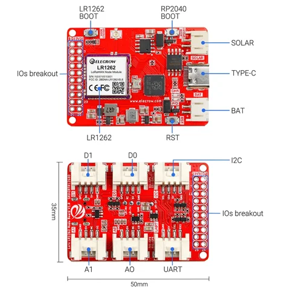

# LR1262 LoRaWAN node board

**Elecrow** · RP2040 / STM32WLE5CC

Revision: PCB revision not established

Coverage: Supporting references; complete physical pinout still needed

[Browse all manufacturers](../../../../BROWSE.md) · [Devices & IoT](../../../../DEVICES.md) · [Open in the browser guide](https://valleytech-black-wire-guide.pages.dev/?board=elecrow-lr1262-node)

## Datasheets and original documentation

Board datasheet: **not yet recorded**. Visual reference: **available**.

[Original manufacturer / project documentation](https://www.elecrow.com/wiki/LR1262_Node_Board_LoRaWan_Node_Module_for_Long_Range_Communication.html)

- **hardware-guide / board**: [Manufacturer specifications and interface documentation](https://www.elecrow.com/wiki/LR1262_Node_Board_LoRaWan_Node_Module_for_Long_Range_Communication.html) · online

Source identity and visual scope reviewed. Pin assignments and electrical limits are not independently bench-verified. Match the exact PCB revision, connector view and populated options. Module pin numbers do not establish carrier-header numbering. Follow the exact module or carrier schematic. GPIO-group labels and pin tables are explicitly separate from full physical maps.

[Documentation coverage and remaining gaps](../../../../DOCUMENTATION.md)

## LR1262 LoRaWAN node board — connector reference

**board labeling image** · Source visual inspected; independent electrical and all-pin completeness review pending · WEBP

[Open original reference](../../../../library/media/93ff7893b9c81d0bf7cdcc93725fbb0b68b3ee8392f840c2235c4aaa5bcce4a4.webp)

**Credit and rights:** Elecrow / original artwork contributors. Asset-specific redistribution and print rights are not established; Black Wire licenses do not relicense this source artwork.. Source/manufacturer: Elecrow.

[Source 1](https://www.elecrow.com/wiki/assets/images/LR1262_Node_Board_LoRaWan_Node_Module_for_Long_Range_Communication/LR1262_node_board_onterface_overview.webp) · [Source 2](https://www.elecrow.com/wiki/LR1262_Node_Board_LoRaWan_Node_Module_for_Long_Range_Communication.html)

Source identity and visual scope reviewed. Pin assignments and electrical limits are not independently bench-verified. Match the exact PCB revision, connector view and populated options. Module pin numbers do not establish carrier-header numbering. Follow the exact module or carrier schematic. GPIO-group labels and pin tables are explicitly separate from full physical maps.

Image revision: PCB revision not established

SHA-256: `93ff7893b9c81d0bf7cdcc93725fbb0b68b3ee8392f840c2235c4aaa5bcce4a4`

Pin assignments have not been independently electrically verified. Check board revision before wiring.
