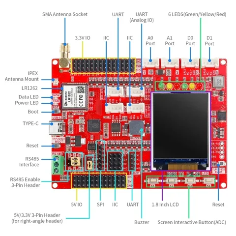

# LR1262 RP2040 development board with 1.8-inch LCD

**Elecrow** · RP2040 / STM32WLE5CC

Revision: PCB revision not established

Coverage: Supporting references; complete physical pinout still needed

[Browse all manufacturers](../../../../BROWSE.md) · [Devices & IoT](../../../../DEVICES.md) · [Open in the browser guide](https://valleytech-black-wire-guide.pages.dev/?board=elecrow-lr1262-lcd)

## Datasheets and original documentation

Board datasheet: **not yet recorded**. Visual reference: **available**.

[Original manufacturer / project documentation](https://www.elecrow.com/wiki/LoRaWAN_LR1262_Development_Board_Integrated_RP2040_with_1.8LCD_for_Long_Range_Communication.html)

- **hardware-guide / board**: [Manufacturer specifications and interface documentation](https://www.elecrow.com/wiki/LoRaWAN_LR1262_Development_Board_Integrated_RP2040_with_1.8LCD_for_Long_Range_Communication.html) · online
- **schematic / board**: [Eagle_SCH&PCB/Lora_LR1262_Node_ Board_V1.0.pdf](https://raw.githubusercontent.com/Elecrow-RD/LoRaWAN-LR1262-Development-Board-Integrated-RP2040-with-1.8-LCD/0ad5ea07c0b66c23d54e7ef0488616d4fe7c1d80/Eagle_SCH%26PCB/Lora_LR1262_Node_%20Board_V1.0.pdf) · [saved document](../../../../library/media/bfbd1860a1adf31dd14279c239c289cb65ca849ba348a1e723c9c9ace5a3a518.pdf)

Source identity and visual scope reviewed. Pin assignments and electrical limits are not independently bench-verified. Match the exact PCB revision, connector view and populated options. Module pin numbers do not establish carrier-header numbering. Follow the exact module or carrier schematic. GPIO-group labels and pin tables are explicitly separate from full physical maps.

[Documentation coverage and remaining gaps](../../../../DOCUMENTATION.md)

## LR1262 RP2040 development board with 1.8-inch LCD — connector reference

**board labeling image** · Source visual inspected; independent electrical and all-pin completeness review pending · WEBP

[Open original reference](../../../../library/media/32b599b2d30654e87c2801279a1e520e085328f3129e01c953da561cf235ad1d.webp)

**Credit and rights:** Elecrow / original artwork contributors. Asset-specific redistribution and print rights are not established; Black Wire licenses do not relicense this source artwork.. Source/manufacturer: Elecrow.

[Source 1](https://www.elecrow.com/wiki/assets/images/LoRaWAN_LR1262_Development_Board_Integrated_RP2040_with_1.8LCD_for_Long_Range_Communication/1262-dev.webp) · [Source 2](https://www.elecrow.com/wiki/LoRaWAN_LR1262_Development_Board_Integrated_RP2040_with_1.8LCD_for_Long_Range_Communication.html)

Source identity and visual scope reviewed. Pin assignments and electrical limits are not independently bench-verified. Match the exact PCB revision, connector view and populated options. Module pin numbers do not establish carrier-header numbering. Follow the exact module or carrier schematic. GPIO-group labels and pin tables are explicitly separate from full physical maps.

Image revision: PCB revision not established

SHA-256: `32b599b2d30654e87c2801279a1e520e085328f3129e01c953da561cf235ad1d`

## Eagle_SCH&PCB/Lora_LR1262_Node_ Board_V1.0.pdf

**original reference PDF** · Source visual inspected; independent electrical and all-pin completeness review pending · PDF

[Open original reference](../../../../library/media/bfbd1860a1adf31dd14279c239c289cb65ca849ba348a1e723c9c9ace5a3a518.pdf)

**Credit and rights:** Elecrow / original artwork contributors. Asset-specific redistribution and print rights are not established; Black Wire licenses do not relicense this source artwork.. Source/manufacturer: Elecrow.

[Source 1](https://raw.githubusercontent.com/Elecrow-RD/LoRaWAN-LR1262-Development-Board-Integrated-RP2040-with-1.8-LCD/0ad5ea07c0b66c23d54e7ef0488616d4fe7c1d80/Eagle_SCH%26PCB/Lora_LR1262_Node_%20Board_V1.0.pdf) · [Source 2](https://www.elecrow.com/wiki/LoRaWAN_LR1262_Development_Board_Integrated_RP2040_with_1.8LCD_for_Long_Range_Communication.html)

Source identity and visual scope reviewed. Pin assignments and electrical limits are not independently bench-verified. Match the exact PCB revision, connector view and populated options. Module pin numbers do not establish carrier-header numbering. Follow the exact module or carrier schematic. GPIO-group labels and pin tables are explicitly separate from full physical maps.

Image revision: PCB revision not established

SHA-256: `bfbd1860a1adf31dd14279c239c289cb65ca849ba348a1e723c9c9ace5a3a518`

Pin assignments have not been independently electrically verified. Check board revision before wiring.
