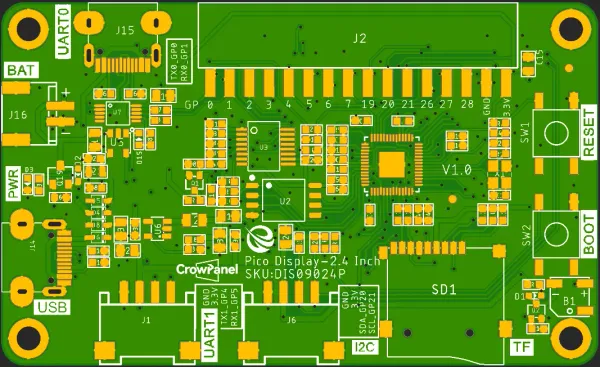

# CrowPanel PICO HMI 2.4-inch Display

**Elecrow** · RP2040

Revision: V1.0 printed on PCB diagram  
Coverage: Pinout image collected

[Browse all manufacturers](../../../../BROWSE.md) · [Desktop app](https://github.com/valleytechsolutions/black-wire-desktop)

## Board pin map

**pinout image** · Reviewed source · WEBP

[Open original reference](../../../../library/media/0a491bbeea5a10d114513da6d508913abaf75b67ef6aec1f591fc83c1890e522.webp)

**Credit and rights:** Not established; source attribution retained. Source/manufacturer: Elecrow.

[Source 1](https://www.elecrow.com/wiki/assets/images/CrowPanel_Pico_HMI_Display-2.4/PICO-HMI-2.4-PCB.webp) · [Source 2](https://www.elecrow.com/wiki/CrowPanel_Pico_HMI_Display-2.4.html)

Manufacturer image preserved. Match the depicted board and revision before use.

SHA-256: `0a491bbeea5a10d114513da6d508913abaf75b67ef6aec1f591fc83c1890e522`

Pin assignments have not been independently electrically verified. Check board revision before wiring.
