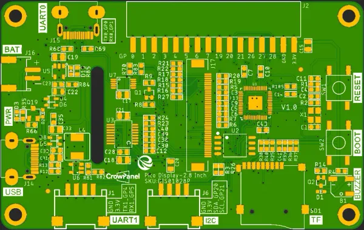

# CrowPanel PICO HMI 2.8-inch Display

**Elecrow** · RP2040

Revision: V1.0 printed on PCB diagram  
Coverage: Pinout image collected

[Browse all manufacturers](../../../../BROWSE.md) · [Desktop app](https://github.com/valleytechsolutions/black-wire-desktop)

## Board pin map

**pinout image** · Reviewed source · WEBP

[Open original reference](../../../../library/media/94b9ab0d0e9e3e227e15b4af50a2b6876e2aec92bb5ecfe4c281bc5c2da0a235.webp)

**Credit and rights:** Not established; source attribution retained. Source/manufacturer: Elecrow.

[Source 1](https://www.elecrow.com/wiki/assets/images/CrowPanel_Pico_HMI_Display-2.8/1.webp) · [Source 2](https://www.elecrow.com/wiki/CrowPanel_Pico_HMI_Display-2.8.html)

Manufacturer image preserved. Match the depicted board and revision before use.

SHA-256: `94b9ab0d0e9e3e227e15b4af50a2b6876e2aec92bb5ecfe4c281bc5c2da0a235`

Pin assignments have not been independently electrically verified. Check board revision before wiring.
