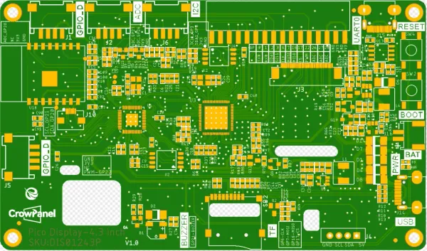

# CrowPanel PICO HMI 4.3-inch Display

**Elecrow** · RP2040

Revision: V1.0 printed on PCB diagram

Coverage: Pinout image collected

[Browse all manufacturers](../../../../BROWSE.md) · [Devices & IoT](../../../../DEVICES.md) · [Open in the browser guide](https://valleytech-black-wire-guide.pages.dev/?board=elecrow-rp2040-crowpanel-pico-hmi-4-3-inch-display)

## Datasheets and original documentation

Board datasheet: **not yet recorded**. Visual reference: **available**.

[Manufacturer source (recorded link)](https://www.elecrow.com/wiki/CrowPanel_Pico_HMI_Display-4.3.html)

A chip datasheet, schematic and board datasheet have different scopes. Match the exact hardware revision.

[Documentation coverage and remaining gaps](../../../../DOCUMENTATION.md)

## Board pin map

**pinout image** · Reviewed source · WEBP

[Open original reference](../../../../library/media/a0c2f7e9b5fd9ed891b67541d30afa37ccf5f5344829563618796b87b7d83115.webp)

**Credit and rights:** Not established; source attribution retained. Source/manufacturer: Elecrow.

[Source 1](https://www.elecrow.com/wiki/assets/images/CrowPanel_Pico_HMI_Display-4.3/PCB.webp) · [Source 2](https://www.elecrow.com/wiki/CrowPanel_Pico_HMI_Display-4.3.html)

Manufacturer image preserved. Match the depicted board and revision before use.

Image revision: V1.0 printed on PCB diagram

SHA-256: `a0c2f7e9b5fd9ed891b67541d30afa37ccf5f5344829563618796b87b7d83115`

Pin assignments have not been independently electrically verified. Check board revision before wiring.
