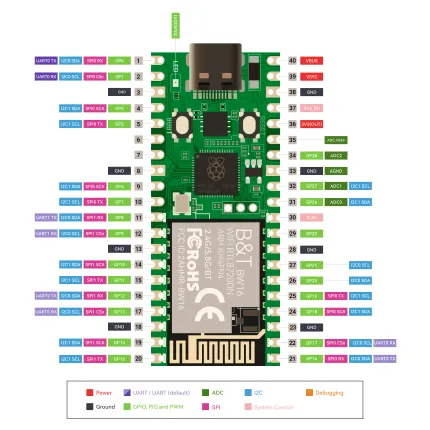

# PICO W5 RP2040 Dev Board

**Elecrow** · RP2040

Revision: Not identified

Coverage: Pinout image collected

[Browse all manufacturers](../../../../BROWSE.md) · [Devices & IoT](../../../../DEVICES.md) · [Open in the browser guide](https://valleytech-black-wire-guide.pages.dev/?board=elecrow-rp2040-pico-w5-rp2040-dev-board)

## Datasheets and original documentation

Board datasheet: **not yet recorded**. Visual reference: **available**.

[Manufacturer source (recorded link)](https://www.elecrow.com/wiki/PICO_W5_RP2040_Dev_Board.html)

A chip datasheet, schematic and board datasheet have different scopes. Match the exact hardware revision.

[Documentation coverage and remaining gaps](../../../../DOCUMENTATION.md)

## Board pin map

**pinout image** · Reviewed source · WEBP

[Open original reference](../../../../library/media/0fbfd86fb16575193cb397ab2ad7d66bc3c16ffe3584bf41312aa3fae3a9e470.webp)

**Credit and rights:** Not established; source attribution retained. Source/manufacturer: Elecrow.

[Source 1](https://www.elecrow.com/wiki/assets/images/PICO_W5_RP2040_Dev_Board/Pin_definition_Pico_W5.webp) · [Source 2](https://www.elecrow.com/wiki/PICO_W5_RP2040_Dev_Board.html)

Manufacturer image preserved. Match the depicted board and revision before use.

Image revision: Not identified

SHA-256: `0fbfd86fb16575193cb397ab2ad7d66bc3c16ffe3584bf41312aa3fae3a9e470`

Pin assignments have not been independently electrically verified. Check board revision before wiring.
