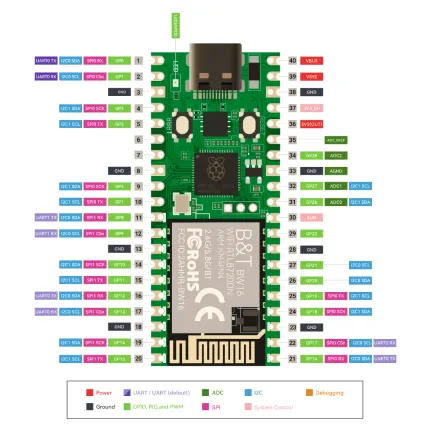

# RP2350 Pico W5

**Elecrow** · RP2350

Revision: Not identified  
Coverage: Pinout image collected

[Browse all manufacturers](../../../../BROWSE.md) · [Desktop app](https://github.com/valleytechsolutions/black-wire-desktop)

## Board pin map

**pinout image** · Reviewed source · WEBP

[Open original reference](../../../../library/media/e7b23e9d684944ce97711415c69863b63d7a1f7e539ffa3d533312e703dabb30.webp)

**Credit and rights:** Not established; source attribution retained. Source/manufacturer: Elecrow.

[Source 1](https://www.elecrow.com/wiki/assets/images/Elecrow_RP2350_Pico_W5_Board/pico_w5_with_rp2350_chip_2.webp) · [Source 2](https://www.elecrow.com/wiki/Elecrow_RP2350_Pico_W5_Board.html)

Manufacturer image preserved. Match the depicted board and revision before use.

SHA-256: `e7b23e9d684944ce97711415c69863b63d7a1f7e539ffa3d533312e703dabb30`

Pin assignments have not been independently electrically verified. Check board revision before wiring.
