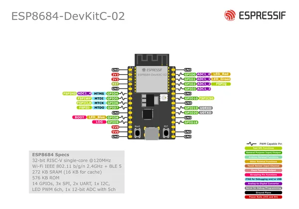

# ESP8684-DEVKITC-02

**Espressif** · ESP32-C2

Revision: Multiple source/revision records; see individual assets  
Coverage: Pinout image collected

[Browse all manufacturers](../../../../BROWSE.md) · [Desktop app](https://github.com/valleytechsolutions/black-wire-desktop)

## Manufacturer board pinout

**pinout image** · Reviewed source · PNG

[Open original reference](../../../../library/media/1219d9020c22aa7c779481bc8b07f0b66da789de0f48abfbd11f8060d7fd000d.png)

**Credit and rights:** Not established; source attribution retained. Source/manufacturer: Espressif.

[Source 1](https://raw.githubusercontent.com/espressif/esp-dev-kits/ab7aff2e0c171e6918c88555b700798f36caeb67/docs/_static/esp8684-devkitc-02/esp8684-devkitc-02-pinout_v1.0.png) · [Source 2](https://github.com/espressif/esp-dev-kits/blob/ab7aff2e0c171e6918c88555b700798f36caeb67/docs/_static/esp8684-devkitc-02/esp8684-devkitc-02-pinout_v1.0.png)

Original image from the manufacturer documentation repository; exact commit recorded in source URL.

SHA-256: `1219d9020c22aa7c779481bc8b07f0b66da789de0f48abfbd11f8060d7fd000d`

Pin assignments have not been independently electrically verified. Check board revision before wiring.
