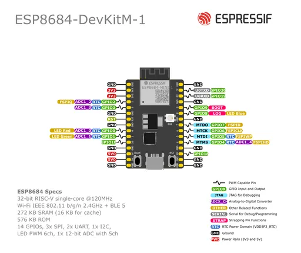

# ESP8684-DEVKITM-1 v1.1

**Espressif** · ESP32-C2

Revision: Source filename: esp8684-devkitm-1-pinout_v1.1.png

Coverage: Pinout image collected

[Browse all manufacturers](../../../../BROWSE.md) · [Devices & IoT](../../../../DEVICES.md) · [Open in the browser guide](https://valleytech-black-wire-guide.pages.dev/?board=espressif-esp32-esp8684-devkitm-1-v1-1)

## Datasheets and original documentation

Board datasheet: **not yet recorded**. Visual reference: **available**.

Original manufacturer website still needs identification.

A chip datasheet, schematic and board datasheet have different scopes. Match the exact hardware revision.

[Documentation coverage and remaining gaps](../../../../DOCUMENTATION.md)

## Manufacturer board pin layout

**pinout image** · Reviewed source · PNG

[Open original reference](../../../../library/media/2223b449774f2a3d77fc7be8c46f9c38bd4bdb3e1bf6f4a898694f41c3a27863.png)

**Credit and rights:** Not established; source attribution retained. Source/manufacturer: Espressif.

[Source 1](https://raw.githubusercontent.com/espressif/esp-dev-kits/ab7aff2e0c171e6918c88555b700798f36caeb67/docs/_static/esp8684-devkitm-1/esp8684-devkitm-1-pinout_v1.1.png) · [Source 2](https://github.com/espressif/esp-dev-kits/blob/ab7aff2e0c171e6918c88555b700798f36caeb67/docs/_static/esp8684-devkitm-1/esp8684-devkitm-1-pinout_v1.1.png)

Image revision: Source filename: esp8684-devkitm-1-pinout_v1.1.png

SHA-256: `2223b449774f2a3d77fc7be8c46f9c38bd4bdb3e1bf6f4a898694f41c3a27863`

Pin assignments have not been independently electrically verified. Check board revision before wiring.
