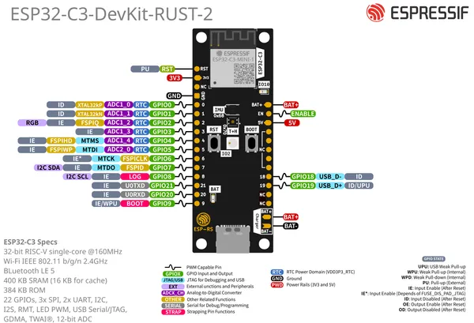

# ESP32-C3-DEVKIT-RUST-2

**Espressif** · ESP32-C3

Revision: Multiple source/revision records; see individual assets  
Coverage: Pinout image collected

[Browse all manufacturers](../../../../BROWSE.md) · [Desktop app](https://github.com/valleytechsolutions/black-wire-desktop)

## Manufacturer board pinout

**pinout image** · Reviewed source · PNG

[Open original reference](../../../../library/media/c5b92d82ab3895927ee2c443232b44867e18f38ab3e460341cf06d00e6c63a70.png)

**Credit and rights:** Not established; source attribution retained. Source/manufacturer: Espressif.

[Source 1](https://raw.githubusercontent.com/espressif/esp-dev-kits/ab7aff2e0c171e6918c88555b700798f36caeb67/docs/_static/esp32-c3-devkit-rust-2/esp32-c3-devkit-rust-2-pinlayout.png) · [Source 2](https://github.com/espressif/esp-dev-kits/blob/ab7aff2e0c171e6918c88555b700798f36caeb67/docs/_static/esp32-c3-devkit-rust-2/esp32-c3-devkit-rust-2-pinlayout.png)

Original image from the manufacturer documentation repository; exact commit recorded in source URL.

SHA-256: `c5b92d82ab3895927ee2c443232b44867e18f38ab3e460341cf06d00e6c63a70`

Pin assignments have not been independently electrically verified. Check board revision before wiring.
