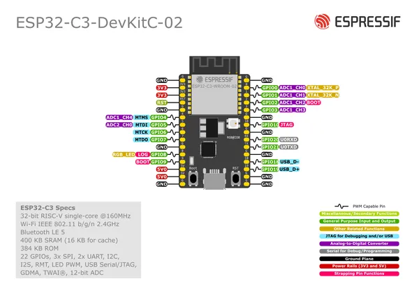
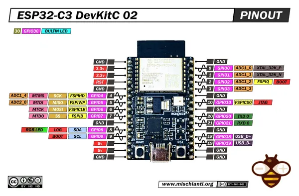

# ESP32-C3-DEVKITC-02

**Espressif** · ESP32-C3

Revision: Multiple source/revision records; see individual assets  
Coverage: Pinout image collected

[Browse all manufacturers](../../../../BROWSE.md) · [Desktop app](https://github.com/valleytechsolutions/black-wire-desktop)

## Manufacturer board pinout

**pinout image** · Reviewed source · PNG

[Open original reference](../../../../library/media/4e5591dd28a0fbd5c83ce8ecb4549dd5c349fb8b035a3013b18a8b4ab616a8c2.png)

**Credit and rights:** Not established; source attribution retained. Source/manufacturer: Espressif.

[Source 1](https://raw.githubusercontent.com/espressif/esp-dev-kits/ab7aff2e0c171e6918c88555b700798f36caeb67/docs/_static/esp32-c3-devkitc-02/esp32-c3-devkitc-02-v1-pinout.png) · [Source 2](https://github.com/espressif/esp-dev-kits/blob/ab7aff2e0c171e6918c88555b700798f36caeb67/docs/_static/esp32-c3-devkitc-02/esp32-c3-devkitc-02-v1-pinout.png)

Original image from the manufacturer documentation repository; exact commit recorded in source URL.

SHA-256: `4e5591dd28a0fbd5c83ce8ecb4549dd5c349fb8b035a3013b18a8b4ab616a8c2`

## Pinout - Renzo Mischianti

**pinout image** · Reviewed source · JPG

[Open original reference](../../../../library/media/5c38137ec085b2fc53afc28c123f76ef1b0eb3d0941320b823fd1fde236c0327.jpg)

**Credit and rights:** CC BY-NC-ND marking visible on image; exact license version and publication permissions not established. Source/manufacturer: Espressif.

[Source 1](https://mischianti.org/wp-content/uploads/2023/04/ESP32-C3-DevKitC-02-pinout-low.jpg) · [Source 2](https://mischianti.org/esp32-c3-devkitc-02-high-resolution-pinout-and-specs/)

Original public image by Renzo Mischianti, unchanged. Diagram/model matching is visual, not electrical verification. Exact PCB layout and revision must match; no inference of compatibility with lookalike marketplace clones.

SHA-256: `5c38137ec085b2fc53afc28c123f76ef1b0eb3d0941320b823fd1fde236c0327`

Pin assignments have not been independently electrically verified. Check board revision before wiring.
