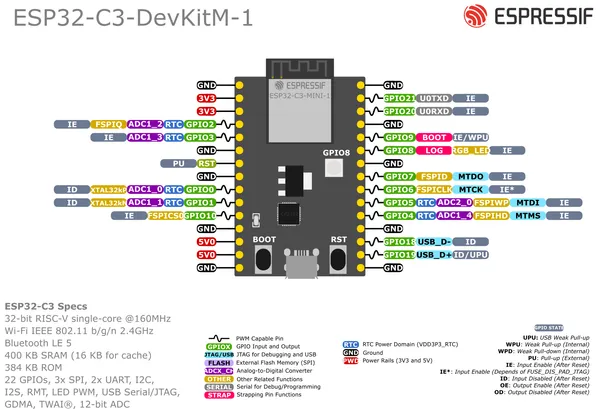

# ESP32-C3-DEVKITM-1

**Espressif** · ESP32-C3

Revision: Multiple source/revision records; see individual assets

Coverage: Pinout image collected

[Browse all manufacturers](../../../../BROWSE.md) · [Devices & IoT](../../../../DEVICES.md) · [Open in the browser guide](https://valleytech-black-wire-guide.pages.dev/?board=espressif-esp32-esp32-c3-devkitm-1)

## Datasheets and original documentation

Board datasheet: **not yet recorded**. Visual reference: **available**.

Original manufacturer website still needs identification.

A chip datasheet, schematic and board datasheet have different scopes. Match the exact hardware revision.

[Documentation coverage and remaining gaps](../../../../DOCUMENTATION.md)

## Manufacturer board pinout

**pinout image** · Reviewed source · PNG

[Open original reference](../../../../library/media/fc7af279350219e235de68524038271ce9dc4cfa28c908b7315eee2676c997c7.png)

**Credit and rights:** Not established; source attribution retained. Source/manufacturer: Espressif.

[Source 1](https://raw.githubusercontent.com/espressif/esp-dev-kits/ab7aff2e0c171e6918c88555b700798f36caeb67/docs/_static/esp32-c3-devkitm-1/esp32-c3-devkitm-1-v1-pinout.png) · [Source 2](https://github.com/espressif/esp-dev-kits/blob/ab7aff2e0c171e6918c88555b700798f36caeb67/docs/_static/esp32-c3-devkitm-1/esp32-c3-devkitm-1-v1-pinout.png)

Original image from the manufacturer documentation repository; exact commit recorded in source URL.

Image revision: v1

SHA-256: `fc7af279350219e235de68524038271ce9dc4cfa28c908b7315eee2676c997c7`

Pin assignments have not been independently electrically verified. Check board revision before wiring.
