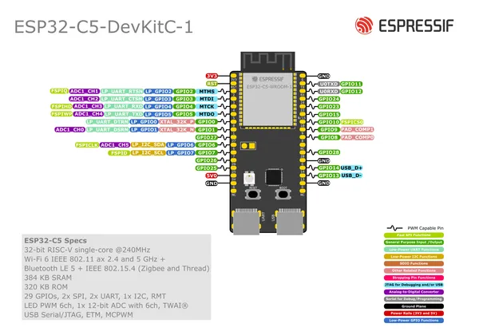
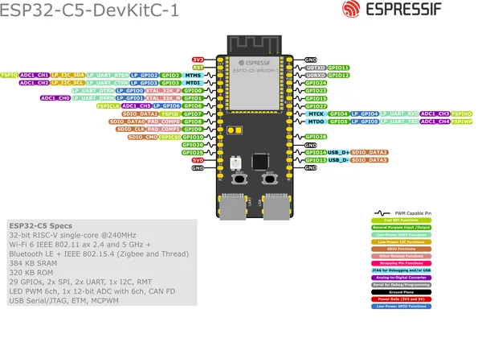

# ESP32-C5-DEVKITC-1

**Espressif** · ESP32-C5

Revision: Multiple source/revision records; see individual assets  
Coverage: Pinout image collected

[Browse all manufacturers](../../../../BROWSE.md) · [Desktop app](https://github.com/valleytechsolutions/black-wire-desktop)

## Manufacturer board pinout

**pinout image** · Reviewed source · PNG

[Open original reference](../../../../library/media/c36a71d029cd438c67f5e6bfcf6653a4c49115f1f1d855ed2aa7357c0e481383.png)

**Credit and rights:** Not established; source attribution retained. Source/manufacturer: Espressif.

[Source 1](https://raw.githubusercontent.com/espressif/esp-dev-kits/ab7aff2e0c171e6918c88555b700798f36caeb67/docs/_static/esp32-c5-devkitc-1/esp32-c5-devkitc-1-pin-layout_v1.1.png) · [Source 2](https://github.com/espressif/esp-dev-kits/blob/ab7aff2e0c171e6918c88555b700798f36caeb67/docs/_static/esp32-c5-devkitc-1/esp32-c5-devkitc-1-pin-layout_v1.1.png)

Original image from the manufacturer documentation repository; exact commit recorded in source URL.

SHA-256: `c36a71d029cd438c67f5e6bfcf6653a4c49115f1f1d855ed2aa7357c0e481383`

## Manufacturer board pinout

**pinout image** · Reviewed source · PNG

[Open original reference](../../../../library/media/70967c5a07c43d472512cf498fb99dcde90cf8c5f11bc1d3bd2c6e584938ee06.png)

**Credit and rights:** Not established; source attribution retained. Source/manufacturer: Espressif.

[Source 1](https://raw.githubusercontent.com/espressif/esp-dev-kits/ab7aff2e0c171e6918c88555b700798f36caeb67/docs/_static/esp32-c5-devkitc-1/esp32-c5-devkitc-1-pin-layout_v1.2.png) · [Source 2](https://github.com/espressif/esp-dev-kits/blob/ab7aff2e0c171e6918c88555b700798f36caeb67/docs/_static/esp32-c5-devkitc-1/esp32-c5-devkitc-1-pin-layout_v1.2.png)

Original image from the manufacturer documentation repository; exact commit recorded in source URL.

SHA-256: `70967c5a07c43d472512cf498fb99dcde90cf8c5f11bc1d3bd2c6e584938ee06`

Pin assignments have not been independently electrically verified. Check board revision before wiring.
