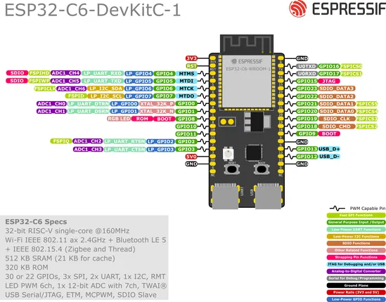
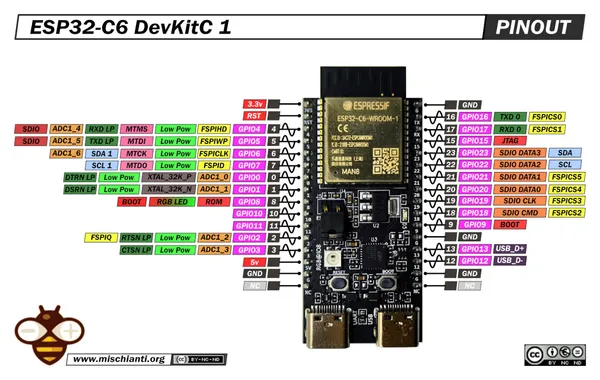

# ESP32-C6-DEVKITC-1

**Espressif** · ESP32-C6

Revision: Multiple source/revision records; see individual assets  
Coverage: Pinout image collected

[Browse all manufacturers](../../../../BROWSE.md) · [Desktop app](https://github.com/valleytechsolutions/black-wire-desktop)

## Manufacturer board pinout

**pinout image** · Reviewed source · PNG

[Open original reference](../../../../library/media/fe44a432672e82328852fedde18eec76740e99935f48d237ccdd29a0af464074.png)

**Credit and rights:** Not established; source attribution retained. Source/manufacturer: Espressif.

[Source 1](https://raw.githubusercontent.com/espressif/esp-dev-kits/ab7aff2e0c171e6918c88555b700798f36caeb67/docs/_static/esp32-c6-devkitc-1/esp32-c6-devkitc-1-pin-layout.png) · [Source 2](https://github.com/espressif/esp-dev-kits/blob/ab7aff2e0c171e6918c88555b700798f36caeb67/docs/_static/esp32-c6-devkitc-1/esp32-c6-devkitc-1-pin-layout.png)

Original image from the manufacturer documentation repository; exact commit recorded in source URL.

SHA-256: `fe44a432672e82328852fedde18eec76740e99935f48d237ccdd29a0af464074`

## Pinout - Renzo Mischianti

**pinout image** · Reviewed source · JPG

[Open original reference](../../../../library/media/a9227d32c6dca54ff84e74a0c1f42b03b1f7ff0c7a3f163e629682481922768d.jpg)

**Credit and rights:** CC BY-NC-ND marking visible on image; exact license version and publication permissions not established. Source/manufacturer: Espressif.

[Source 1](https://mischianti.org/wp-content/uploads/2025/11/Espressif-esp32-c6-devkitc-1-low-pinout.jpg) · [Source 2](https://mischianti.org/esp32-c6-devkitc-1-high-resolution-pinout-datasheet-schema-and-specs/)

Original public image by Renzo Mischianti, unchanged. Diagram/model matching is visual, not electrical verification. Exact PCB layout and revision must match; no inference of compatibility with lookalike marketplace clones.

SHA-256: `a9227d32c6dca54ff84e74a0c1f42b03b1f7ff0c7a3f163e629682481922768d`

Pin assignments have not been independently electrically verified. Check board revision before wiring.
