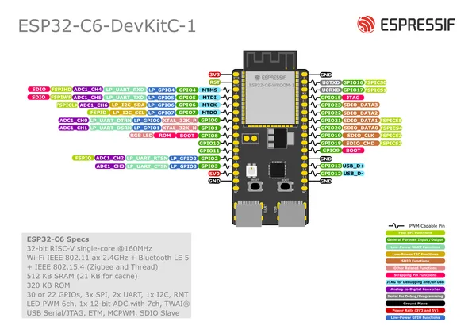

# ESP32-C6-DevKitC-1-N8

**Espressif** · ESP32-C6

Revision: Not identified  
Coverage: Pinout image collected

[Browse all manufacturers](../../../../BROWSE.md) · [Desktop app](https://github.com/valleytechsolutions/black-wire-desktop)

## Physical board pinout

**pinout image** · Reviewed source · PNG

[Open original reference](../../../../library/media/21e7f6f6c57c984b603aff72b0c02716f29bc762401e3309d35dc773b6b4b070.png)

**Credit and rights:** Not established; source attribution retained. Source/manufacturer: Espressif.

[Source 1](https://cdn-shop.adafruit.com/product-files/5672/5672_esp32-c6-devkitc-1-pin-layout.png) · [Source 2](https://www.adafruit.com/product/5672)

Discovered from CircuitPython board metadata and the linked product/documentation page. Exact hardware revision requires matching to the diagram.

SHA-256: `21e7f6f6c57c984b603aff72b0c02716f29bc762401e3309d35dc773b6b4b070`

Pin assignments have not been independently electrically verified. Check board revision before wiring.
