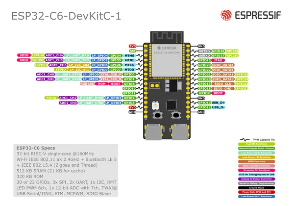

# ESP32-C6-DevKitC-1-N8

**Espressif** · ESP32-C6

Revision: Not identified

Coverage: Pinout image collected

[Browse all manufacturers](../../../../BROWSE.md) · [Devices & IoT](../../../../DEVICES.md) · [Open in the browser guide](https://valleytech-black-wire-guide.pages.dev/?board=espressif-esp32-esp32-c6-devkitc-1-n8)

## Datasheets and original documentation

Board datasheet: **not yet recorded**. Visual reference: **available**.

Original manufacturer website still needs identification.

A chip datasheet, schematic and board datasheet have different scopes. Match the exact hardware revision.

[Documentation coverage and remaining gaps](../../../../DOCUMENTATION.md)

## Physical board pinout

**pinout image** · Reviewed source · PNG

[Open original reference](../../../../library/media/21e7f6f6c57c984b603aff72b0c02716f29bc762401e3309d35dc773b6b4b070.png)

**Credit and rights:** Not established; source attribution retained. Source/manufacturer: Espressif.

[Source 1](https://cdn-shop.adafruit.com/product-files/5672/5672_esp32-c6-devkitc-1-pin-layout.png) · [Source 2](https://www.adafruit.com/product/5672)

Discovered from CircuitPython board metadata and the linked product/documentation page. Exact hardware revision requires matching to the diagram.

Image revision: Not identified

SHA-256: `21e7f6f6c57c984b603aff72b0c02716f29bc762401e3309d35dc773b6b4b070`

Pin assignments have not been independently electrically verified. Check board revision before wiring.
