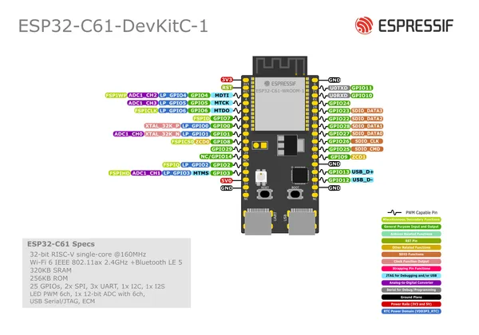
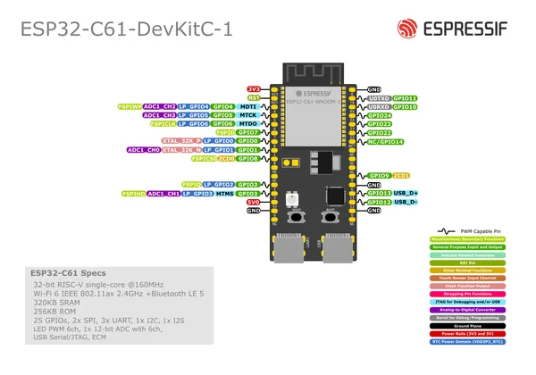

# ESP32-C61-DEVKITC-1

**Espressif** · ESP32-C61

Revision: Multiple source/revision records; see individual assets  
Coverage: Pinout image collected

[Browse all manufacturers](../../../../BROWSE.md) · [Desktop app](https://github.com/valleytechsolutions/black-wire-desktop)

## Manufacturer board pinout

**pinout image** · Reviewed source · PNG

[Open original reference](../../../../library/media/7baf5f6a70c568f4328ba9d0212f7ad179e8fd9f278ef66a9e7a812c353b380e.png)

**Credit and rights:** Not established; source attribution retained. Source/manufacturer: Espressif.

[Source 1](https://raw.githubusercontent.com/espressif/esp-dev-kits/ab7aff2e0c171e6918c88555b700798f36caeb67/docs/_static/esp32-c61-devkitc-1/esp32-c61-devkitc-1-pin-layout-v2.png) · [Source 2](https://github.com/espressif/esp-dev-kits/blob/ab7aff2e0c171e6918c88555b700798f36caeb67/docs/_static/esp32-c61-devkitc-1/esp32-c61-devkitc-1-pin-layout-v2.png)

Original image from the manufacturer documentation repository; exact commit recorded in source URL.

SHA-256: `7baf5f6a70c568f4328ba9d0212f7ad179e8fd9f278ef66a9e7a812c353b380e`

## Manufacturer board pinout

**pinout image** · Reviewed source · PNG

[Open original reference](../../../../library/media/237d03b2749f33c2bf11a372688efddf90d24dab967f065829c6fdcd8f3a75ee.png)

**Credit and rights:** Not established; source attribution retained. Source/manufacturer: Espressif.

[Source 1](https://raw.githubusercontent.com/espressif/esp-dev-kits/ab7aff2e0c171e6918c88555b700798f36caeb67/docs/_static/esp32-c61-devkitc-1/esp32-c61-devkitc-1-pin-layout.png) · [Source 2](https://github.com/espressif/esp-dev-kits/blob/ab7aff2e0c171e6918c88555b700798f36caeb67/docs/_static/esp32-c61-devkitc-1/esp32-c61-devkitc-1-pin-layout.png)

Original image from the manufacturer documentation repository; exact commit recorded in source URL.

SHA-256: `237d03b2749f33c2bf11a372688efddf90d24dab967f065829c6fdcd8f3a75ee`

Pin assignments have not been independently electrically verified. Check board revision before wiring.
